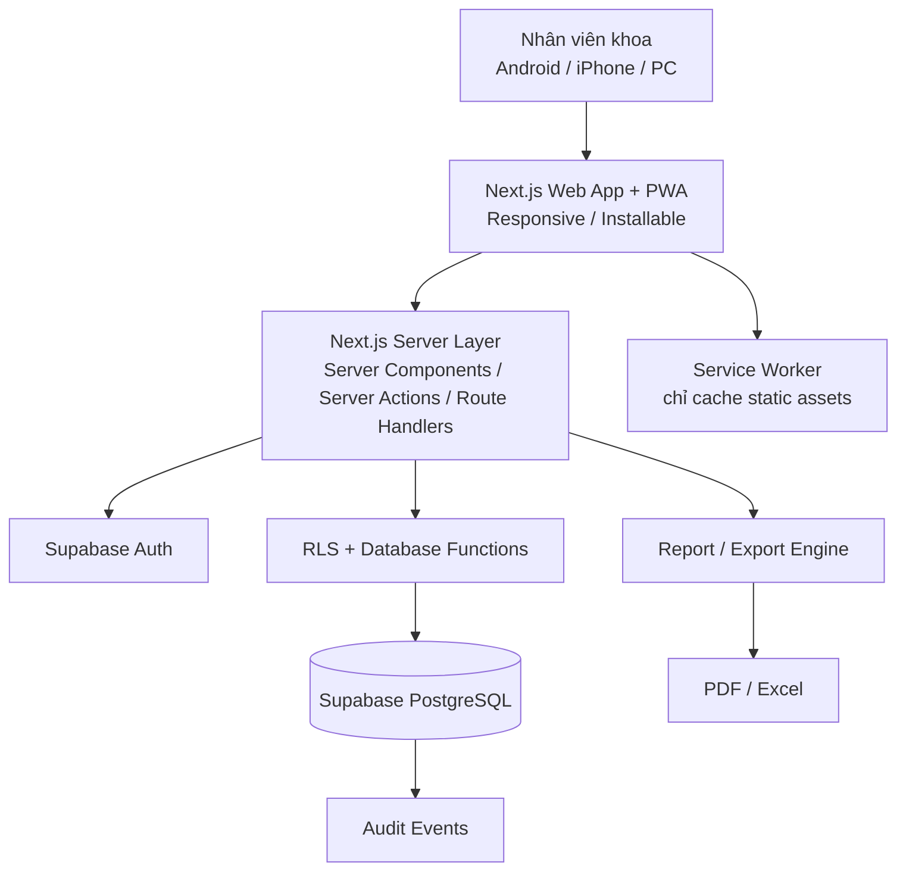
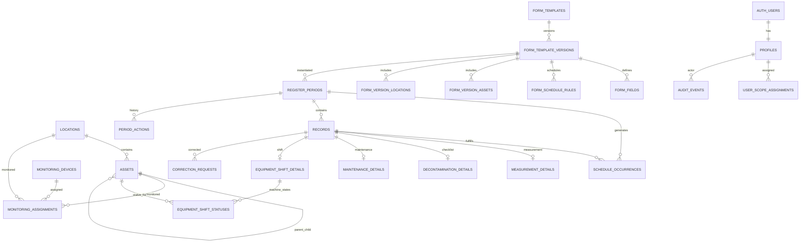
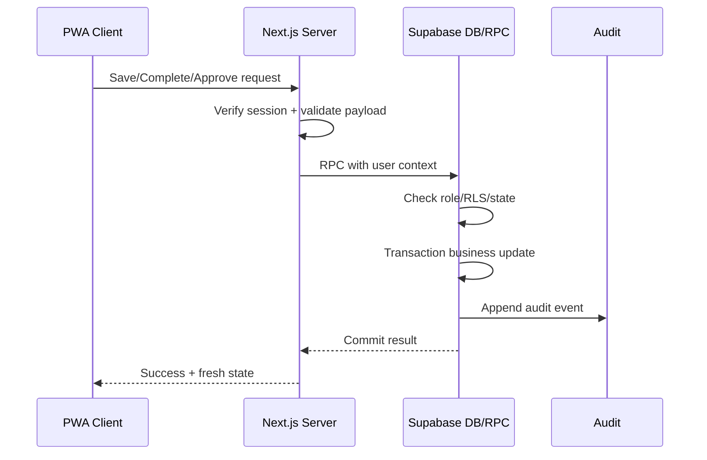
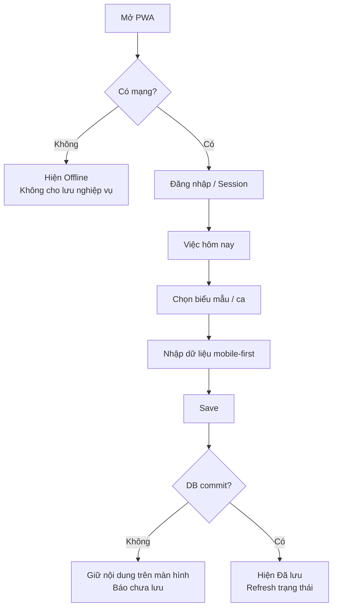
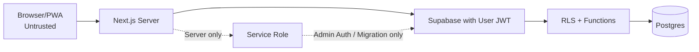
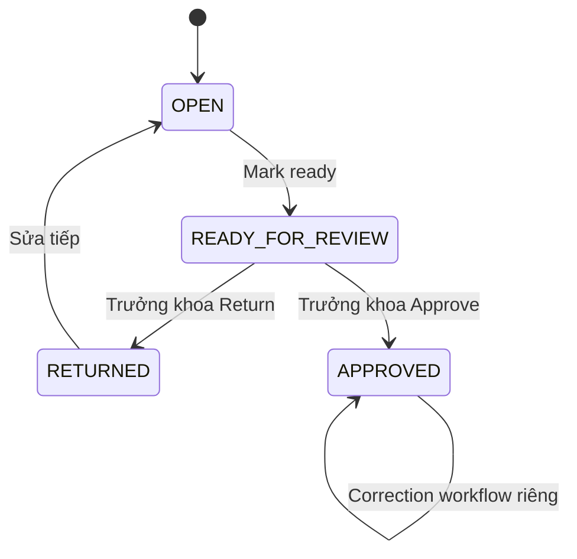

# 01_ARCHITECTURE_FINAL

**Dự án:** Web app quản lý biểu mẫu nội bộ Khoa/Bộ môn Sinh hóa  
**Trạng thái:** FINAL — kiến trúc kỹ thuật và mô hình dữ liệu nền cho MVP/Core Pilot  
**Phụ thuộc bắt buộc:**  
- `00_PRODUCT_SCOPE_FINAL.md`
- `02_FORMS_DATA_RULES_FINAL.md`

**Mục đích:** Khóa cách hệ thống được xây dựng để AI coding không tự thay đổi phạm vi, không thiết kế database trái nghiệp vụ, và không tạo thêm hạ tầng không cần thiết.

> Nếu file này mâu thuẫn với `00_PRODUCT_SCOPE_FINAL.md` hoặc `02_FORMS_DATA_RULES_FINAL.md`, **không tự chọn một phiên bản**. Dừng task liên quan, sửa đặc tả trước hoặc cùng Pull Request rồi mới tiếp tục code.

---

# 1. Các nguyên tắc kiến trúc đã khóa

## 1.1. Nguồn sự thật

Thứ tự ưu tiên:

1. `00_PRODUCT_SCOPE_FINAL.md` — phạm vi, vai trò, quyết định P0.
2. `02_FORMS_DATA_RULES_FINAL.md` — nghiệp vụ biểu mẫu và quy tắc dữ liệu.
3. `01_ARCHITECTURE_FINAL.md` — cách hiện thực hóa kỹ thuật.
4. `03_SCREEN_MENU_UIUX_FINAL.md` — màn hình và trải nghiệm.
5. `04_IMPLEMENTATION_PLAN_FINAL.md` — thứ tự triển khai/test/release.

Kiến trúc **không được tự thay đổi nghiệp vụ**.

Ví dụ:

- kiến trúc không được tự đổi ngưỡng 21–26°C thành giá trị khác;
- không được đổi BM.06 thành 3 ca hoặc 5 ca;
- không được thêm cấp duyệt Bác sĩ;
- không được biến Admin thành cấp phê duyệt;
- không được cấm nhập bù chỉ vì khung giờ đã qua;
- không được tự thêm báo cáo sự cố vào MVP.

## 1.2. Giữ hệ thống đơn giản

MVP là một **single web application**; không chia microservice.

Không tạo:

- backend service riêng nếu Supabase + Next.js đã đáp ứng;
- message queue;
- Redis;
- Kafka;
- n8n trong lõi;
- server xử lý nền riêng;
- mobile app native riêng;
- hệ thống đồng bộ offline phức tạp.

Mục tiêu là một repo dễ hiểu, dễ audit và dễ giao cho AI coding.

## 1.3. Database là nguồn dữ liệu chính

PostgreSQL trên Supabase là **source of truth**.

Browser/PWA không được xem là nguồn dữ liệu chính.

Dữ liệu nghiệp vụ chỉ được coi là đã lưu khi transaction phía server/database thành công.

## 1.4. Mobile-first nhưng không hy sinh tính toàn vẹn dữ liệu

KTV/Bác sĩ phải nhập thuận tiện trên điện thoại.

Tuy nhiên:

- không dùng offline sync phức tạp trong MVP;
- không giả vờ “đã lưu” khi server chưa xác nhận;
- không cache dữ liệu nghiệp vụ nhạy cảm vào Service Worker;
- không để PWA làm sai lịch sử nhập liệu.

## 1.5. Dữ liệu đã phê duyệt là bất biến

Bản đã phê duyệt:

- không update trực tiếp;
- không delete;
- muốn sửa phải tạo bản đính chính;
- bản gốc vẫn tồn tại;
- báo cáo phải biết đâu là bản hiện hành.

## 1.6. Phân quyền thực thi ở database/backend

Ẩn nút ở UI **không phải bảo mật**.

Mọi bảng nghiệp vụ phải có RLS hoặc chỉ được truy cập thông qua hàm/RPC có kiểm tra quyền phù hợp.

---

# 2. Kiến trúc tổng thể



## 2.1. Frontend

**Next.js + TypeScript**

Trách nhiệm:

- render UI;
- routing;
- responsive mobile/desktop;
- PWA;
- biểu mẫu nhập liệu;
- màn hình sổ/kỳ;
- Dashboard;
- báo cáo;
- gọi các mutation an toàn.

## 2.2. Backend

Không dựng một backend Node riêng.

Backend gồm hai lớp:

1. **Next.js server layer**
   - kiểm tra session;
   - orchestration;
   - gọi database/RPC;
   - sinh báo cáo;
   - thao tác Admin cần secret server-side.

2. **Supabase**
   - Auth;
   - PostgreSQL;
   - RLS;
   - database functions;
   - audit;
   - dữ liệu nghiệp vụ.

## 2.3. Không dùng Supabase Storage cho nghiệp vụ MVP

Do MVP đã khóa:

- chưa cần file/ảnh đính kèm.

Vì vậy Supabase Storage **không phải dependency bắt buộc** cho sáu biểu mẫu.

Có thể dùng static assets của web cho:

- icon PWA;
- logo sau này.

Nếu Version sau bổ sung file đính kèm thì mới thiết kế Storage policy riêng.

---

# 3. PWA — Progressive Web App

## 3.1. PWA là gì trong dự án này

PWA là web app có thể:

- mở bằng trình duyệt;
- cài ra màn hình chính điện thoại;
- chạy ở chế độ gần giống app;
- tự thích nghi màn hình mobile.

PWA **không phải** mobile app native riêng.

Điều này phù hợp quyết định:

- không làm Android/iOS native trong MVP;
- vẫn cần trải nghiệm thuận tiện trên điện thoại.

## 3.2. Yêu cầu bắt buộc

App phải có:

- Web App Manifest;
- icon tối thiểu 192×192 và 512×512;
- icon maskable;
- `display: standalone`;
- `start_url` vào khu vực ứng dụng phù hợp;
- `scope` đúng domain app;
- `theme_color`;
- `background_color`;
- HTTPS ở STAGING/Production;
- Service Worker;
- trang offline/fallback rõ ràng;
- responsive layout;
- hỗ trợ portrait mobile là ưu tiên.

## 3.3. Chiến lược cache FINAL

Để tránh dữ liệu cũ/sai:

### Được cache

- CSS;
- JavaScript bundle;
- font nếu dùng;
- icon;
- ảnh/logo tĩnh;
- offline fallback page;
- asset build có hash/version.

### Không được cache như dữ liệu offline

- Supabase Auth response;
- REST/RPC response nghiệp vụ;
- record biểu mẫu;
- sổ tháng;
- Dashboard;
- dữ liệu phê duyệt;
- báo cáo;
- danh sách user;
- dữ liệu máy/tủ có yêu cầu mới nhất.

Quy tắc:

> Service Worker **không được biến cache thành database thứ hai**.

## 3.4. Offline trong MVP

MVP **không hỗ trợ hoàn tất nghiệp vụ khi offline**.

Nếu mất mạng:

- app hiển thị trạng thái `Mất kết nối`;
- không báo “Đã lưu” nếu server chưa xác nhận;
- không cho Approve/Close/Correction khi offline;
- không background-sync mutation âm thầm;
- dữ liệu đang gõ không bị UI chủ động xóa trong phiên hiện tại;
- khi có mạng lại, người dùng chủ động Save/Submit.

Không xây:

- offline database;
- conflict resolution;
- background sync;
- offline queue phức tạp.

Các phần này chỉ xem xét Version sau nếu Pilot chứng minh có nhu cầu.

## 3.5. PWA update

Service Worker phải gắn với release app.

Khi có bản mới:

- tải asset mới an toàn;
- không dùng mã JS cũ trộn với API/schema mới;
- nếu cần reload, UI báo người dùng;
- không reload cưỡng bức giữa lúc đang nhập form.

## 3.6. Mobile compatibility

Kiến trúc UI phải hỗ trợ tối thiểu:

- Android Chrome;
- iPhone Safari;
- PWA cài ra Home Screen;
- desktop Chrome/Edge.

Các nguyên tắc kỹ thuật:

- viewport responsive;
- `viewport-fit=cover`;
- hỗ trợ safe-area;
- field nhập trên mobile không bị quá nhỏ;
- nút thao tác chính đủ lớn để chạm;
- không buộc người dùng nhập trực tiếp ma trận 31 cột trên điện thoại;
- BM.06 nhập theo danh sách máy dạng card/list, không phải bảng ngang 25 cột;
- bảng/sổ rộng chỉ dùng cho xem/tổng hợp/export.

## 3.7. PWA không thay đổi nghiệp vụ thời gian

PWA chỉ là format ứng dụng.

Nó không được:

- đổi giờ đo;
- tự đánh dấu hoàn thành;
- tự tạo dữ liệu khi offline;
- tự sửa `entered_at`;
- tự làm N/A.

---

# 4. Môi trường và deployment

## 4.1. Ba môi trường logic

```text
LOCAL/DEV
    ↓
STAGING
    ↓
PRODUCTION
```

### DEV

Dùng để:

- code;
- migration;
- seed;
- test;
- dữ liệu giả.

### STAGING

Dùng để:

- UAT;
- Pilot;
- test mobile/PWA;
- test report;
- test RLS;
- test migration gần Production.

### PRODUCTION

Chỉ dùng khi:

- P6/P7 đạt;
- backup/restore test đạt;
- RLS đạt;
- Trưởng khoa Go-Live.

## 4.2. Supabase

Khuyến nghị kiến trúc:

- Supabase DEV riêng;
- Supabase STAGING riêng;
- Supabase PROD riêng.

Không dùng chung database Production với DEV.

## 4.3. Hosting Next.js

Hosting Production chưa khóa trong P0.

Kiến trúc yêu cầu host phải hỗ trợ:

- Next.js;
- HTTPS;
- environment variables;
- server-side execution;
- route handlers/server actions;
- PWA manifest/service worker;
- preview hoặc staging deployment.

Vercel có thể dùng, nhưng file này **không khóa nhà cung cấp**.

## 4.4. Secrets

Không commit:

- Supabase service role key;
- database password;
- token;
- secret.

Client chỉ được nhận public key được thiết kế cho browser.

Service role:

- chỉ tồn tại server/CI;
- không gửi xuống browser;
- chỉ dùng khi thực sự cần thao tác đặc quyền như quản trị Auth/seed/migration.

---

# 5. Mô hình quyền

## 5.1. Profile người dùng

Mỗi user có:

```text
auth.users.id
       │
       ▼
profiles
- user_id
- full_name
- business_role
- is_admin
- active
```

`business_role` chỉ có:

- `DEPARTMENT_HEAD`
- `DOCTOR`
- `TECHNICIAN`

`is_admin`:

- `true`
- `false`

## 5.2. Admin không phải approver

Ví dụ:

```text
Vũ Viết Nam
business_role = TECHNICIAN
is_admin = true
```

Người này:

- có quyền quản trị cấu hình;
- vẫn là KTV về nghiệp vụ;
- không được Approve thay Trưởng khoa.

## 5.3. Scope quyền nhập/xem

Do P0 chưa khóa từng user cụ thể được nhập form/khu vực/máy nào, kiến trúc phải hỗ trợ cấp phạm vi mà không cần đổi schema.

Bảng:

`user_scope_assignments`

Cho phép gán:

- toàn bộ form;
- form cụ thể;
- khu vực;
- asset/máy/tủ.

Core Pilot có thể seed quyền rộng cho nhóm test.

Không hard-code tên người vào code.

## 5.4. Quyền logic

### Trưởng khoa

- read toàn bộ nghiệp vụ;
- review/chốt/return;
- duyệt correction;
- xem Dashboard/report;
- không mặc nhiên có quyền Admin nếu `is_admin=false`.

### Bác sĩ phụ trách

- nhập/sửa dữ liệu trong kỳ đang mở theo scope;
- xem dữ liệu theo scope;
- không Approve.

### Kỹ thuật viên

- nhập/sửa dữ liệu trong kỳ đang mở theo scope;
- xem Việc hôm nay;
- xem lịch sử theo scope;
- không Approve.

### Admin

- quản lý user;
- quản lý master data;
- quản lý template/version Draft;
- seed/import có kiểm soát;
- không bypass phê duyệt nghiệp vụ.

---

# 6. RLS — Row Level Security

RLS là “ổ khóa ở database”.

## 6.1. Nguyên tắc

Tất cả bảng nghiệp vụ người dùng truy cập phải:

- bật RLS;
- có policy cụ thể;
- không dựa vào UI.

## 6.2. Helper functions

Có thể dùng các hàm DB:

- `current_business_role()`
- `current_is_admin()`
- `is_department_head()`
- `can_access_form(form_template_id)`
- `can_access_location(location_id)`
- `can_access_asset(asset_id)`
- `can_edit_period(period_id)`

Hàm dùng trong RLS phải:

- nhỏ;
- deterministic trong phạm vi session;
- không tự grant quyền rộng ngoài đặc tả.

## 6.3. Chính sách mức cao

### Templates / Master Data

Authenticated:

- read Published/Active.

Admin:

- create/update Draft;
- publish thông qua workflow/function được phép.

### Periods / Occurrences / Records

KTV/Bác sĩ:

- read theo scope;
- create/update record khi kỳ còn editable;
- không update record đã khóa;
- không approve.

Trưởng khoa:

- read toàn khoa;
- submit review action;
- return;
- approve.

Admin:

- không được approve chỉ vì `is_admin=true`.

## 6.4. Không cho user thường xóa dữ liệu nghiệp vụ

DELETE trực tiếp:

- cấm với record;
- cấm với period đã có dữ liệu;
- cấm với approval/audit.

Nếu cần ngừng sử dụng master data:

- `active=false`;
- không hard-delete nếu đã có lịch sử.

---

# 7. Kiến trúc Auth

## 7.1. Supabase Auth

MVP dùng Supabase Auth.

Tài khoản app là tài khoản của nhân viên sử dụng ứng dụng.

Đây khác với tài khoản đăng nhập trang quản trị Supabase của người phát triển.

## 7.2. Session

Next.js dùng integration Auth chính thức để:

- đọc session phía server;
- bảo vệ route;
- refresh session;
- sign out.

Không tự viết hệ thống token riêng.

## 7.3. Quản trị tài khoản

Các thao tác cần Supabase Admin API:

- tạo user;
- khóa user;
- reset/chỉnh trạng thái đặc quyền.

Phải qua server-side route/action:

1. xác thực người gọi;
2. kiểm tra `is_admin=true`;
3. mới dùng service role server-side.

Không để service role trong PWA/browser.

---

# 8. Bounded Form + Register Engine

## 8.1. Không xây “Google Forms vô hạn”

Core Pilot chỉ cần engine phục vụ đúng các pattern đã khóa.

Pattern:

1. `MEASUREMENT`
   - BM.01;
   - BM.02;
   - BM.03.

2. `CHECKLIST_REGISTER`
   - Khử nhiễm.

3. `MAINTENANCE_REGISTER`
   - Bảo dưỡng.

4. `MULTI_ASSET_SHIFT_REGISTER`
   - BM.06.

Engine được cấu hình hóa nhưng có giới hạn rõ.

## 8.2. Vì sao dùng engine có giới hạn

Ưu điểm:

- không phải code 6 app khác nhau;
- vẫn giữ database dễ query;
- không làm schema JSON-only khó báo cáo;
- không làm no-code builder quá phức tạp trong 7 ngày.

## 8.3. Template và version

Mỗi form có:

`form_templates`

và nhiều:

`form_template_versions`

Published version:

- immutable;
- không sửa trực tiếp;
- muốn thay đổi phải tạo version mới.

Historical record luôn giữ:

- template ID;
- version ID;
- snapshot context cần thiết.

---

# 9. Schedule Engine

## 9.1. Không cần n8n

Lịch biểu mẫu nằm trong database.

Không cần automation service để biết:

- hôm nay có việc gì;
- tuần này cần làm gì;
- tháng này đã đủ chưa.

## 9.2. Các loại lịch

`schedule_type`:

- `SLOT_DAILY`
- `DAILY`
- `WEEKLY_ONCE`
- `MONTHLY_ONCE`
- `EVENT`

## 9.3. Mapping sáu biểu mẫu

| Mã biểu mẫu FINAL | Pattern kiến trúc | Lịch/nghĩa vụ đã khóa |
|---|---|---|
| `BM.01/QL.HTAT.01` — Nhiệt độ/độ ẩm phòng xét nghiệm | `MEASUREMENT` | 2 slot/ngày: 08:00–09:00 và 14:30–15:30 |
| `BM.02/QL.HTAT.01` — Tủ lạnh mát | `MEASUREMENT` | 2 slot/ngày: 08:00–09:00 và 14:30–15:30 |
| `BM.03/QL.HTAT.01` — Tủ đông/tủ đá | `MEASUREMENT` | 2 slot/ngày: 08:00–09:00 và 14:30–15:30; nguồn hiện hành `NganDa` |
| `BM.01_KNBM` — Khử nhiễm bề mặt | `CHECKLIST_REGISTER` | Hằng ngày + hằng tuần linh động + tràn đổ theo sự kiện |
| `BM.02/QL.TRTB.01` — Bảo dưỡng trang thiết bị | `MAINTENANCE_REGISTER` | Hằng ngày + hằng tuần linh động + hằng tháng linh động |
| `BM.06/QL.TRTB.01` — Nhật ký hoạt động TTB | `MULTI_ASSET_SHIFT_REGISTER` | 4 slot/ngày: 07:00–11:30; 11:30–13:30; 13:30–16:30; 16:30–07:00 hôm sau |

Các giá trị trên là **traceability** từ `02_FORMS_DATA_RULES_FINAL.md`; không được sửa ở code nếu chưa sửa tài liệu nghiệp vụ.

### Quy tắc ngưỡng phải phản ánh trong kiến trúc

- `BM.01/QL.HTAT.01`: nhiệt độ 21–26°C; độ ẩm 20–80%.
- `BM.02/QL.HTAT.01`: nhiệt độ 2–8°C.
- `BM.03/QL.HTAT.01`: nhiệt độ -30 đến -10°C.
- Giá trị ngoài ngưỡng vẫn được lưu và gắn cờ bất thường.

### Khử nhiễm

- Hằng ngày → `DAILY`
- Hằng tuần → `WEEKLY_ONCE`
- Tràn đổ → `EVENT`

### Bảo dưỡng

- Hằng ngày → `DAILY`
- Hằng tuần → `WEEKLY_ONCE`
- Hằng tháng → `MONTHLY_ONCE`

### BM.06

4 × `SLOT_DAILY` với đúng bốn khung giờ FINAL ở bảng trên.

## 9.4. Lịch mềm

Schedule tạo **nghĩa vụ cần hoàn thiện**, không tạo lệnh cấm nhập.

Khung giờ đã qua:

- occurrence có thể bị xem là “còn thiếu/quá giờ”;
- người dùng vẫn nhập bù;
- record vẫn gắn đúng occurrence;
- `entered_at` vẫn là thời gian thật.

## 9.5. Không cần cron cho Core Pilot

Khi tạo period, server tạo occurrence cho kỳ đó.

Ví dụ:

- sổ tháng BM.01 → sinh các ngày hợp lệ × 2 slot;
- BM.06 → ngày trong kỳ × 4 slot;
- KNBM → daily + weekly obligation;
- maintenance → daily + weekly + monthly obligation.

Việc tạo occurrence phải:

- idempotent;
- có unique constraint;
- gọi lại không tạo trùng.

---

# 10. Time model

## 10.1. Ba khái niệm không được trộn

1. `business_date`
   - ngày nghiệp vụ mà dữ liệu thuộc về.

2. `observed_at` / `performed_at`
   - lúc thực tế đo/làm.

3. `entered_at`
   - lúc hệ thống nhận dữ liệu.

## 10.2. entered_at

`entered_at`:

- server/database tự ghi;
- không nhận từ client như nguồn sự thật;
- user không sửa tay.

## 10.3. Night slot BM.06

Khung:

`16:30 → 07:00 hôm sau`

Quy tắc:

- `business_date` là ngày bắt đầu ca;
- `slot_code` xác định NIGHT;
- end time thuộc ngày kế tiếp.

Không dùng ngày 07:00 sáng hôm sau để tạo một ca mới giả.

## 10.4. Time zone

Database lưu thời điểm dạng `timestamptz`.

Logic ngày/ca của app dùng timezone cấu hình của đơn vị.

Core Pilot đặt cấu hình đơn vị theo timezone bệnh viện tại Việt Nam; không hard-code offset `+07:00` rải rác trong code.

Nên có một setting:

`app_timezone`

Mọi chuyển đổi ngày/slot gọi chung helper.

---

# 11. Period / Register model

## 11.1. Vì sao cần Period

Các nguồn là “sổ”, không chỉ là từng phiếu độc lập.

`register_periods` đại diện:

- một tháng của BM.01;
- một tháng của một tủ;
- một tháng khử nhiễm;
- một kỳ bảo dưỡng;
- một kỳ BM.06.

## 11.2. Trạng thái kỳ

Đề xuất trạng thái kỹ thuật:

- `OPEN`
- `READY_FOR_REVIEW`
- `RETURNED`
- `APPROVED`

Không cần tạo nhiều trạng thái nếu không phục vụ nghiệp vụ.

## 11.3. OPEN

- được nhập;
- được nhập bù;
- occurrence có thể được hoàn thiện;
- chưa được coi là báo cáo chính thức.

## 11.4. READY_FOR_REVIEW

- người dùng báo kỳ đã sẵn sàng;
- Trưởng khoa xem;
- không tự đồng nghĩa Approved.

## 11.5. RETURNED

- Trưởng khoa trả lại;
- ghi reason;
- người được phép chỉnh sửa tiếp;
- lịch sử action được giữ.

## 11.6. APPROVED

- chỉ đọc;
- không sửa đè;
- dùng cho báo cáo quản lý chính;
- sai thì correction.

---

# 12. Correction model

## 12.1. Nguyên tắc nguồn

Nguồn đã khóa:

- giữ bản cũ;
- tạo bản đính chính mới;
- biết ai sửa, lúc nào, sửa gì.

## 12.2. Thiết kế

Mỗi record có:

- `revision_no`;
- `revision_of_record_id`;
- `is_effective`;
- `correction_reason` khi là bản đính chính.

Bảng:

`correction_requests`

lưu:

- original record;
- replacement record;
- reason;
- requested_by;
- requested_at;
- status;
- reviewed_by;
- reviewed_at.

## 12.3. Hiệu lực bản đính chính

Để phù hợp nguyên tắc chỉ Trưởng khoa có quyền phê duyệt nghiệp vụ:

- correction mới chưa tự thay thế bản gốc ngay;
- Trưởng khoa xác nhận correction;
- transaction đổi `is_effective`:
  - bản cũ → false;
  - bản mới → true;
- mọi `schedule_occurrences.fulfilled_by_record_id` đang trỏ bản cũ được chuyển sang bản mới;
- cả hai record vẫn tồn tại.

Không delete bản gốc.

---

# 13. Mô hình database tổng thể



---

# 14. Bảng identity và quyền

## 14.1. `profiles`

Mục đích: profile ứng dụng gắn với `auth.users`.

Trường tối thiểu:

```text
user_id uuid PK/FK auth.users
full_name text
business_role text
is_admin boolean default false
active boolean default true
created_at timestamptz
updated_at timestamptz
```

Constraint:

```text
business_role IN (
  'DEPARTMENT_HEAD',
  'DOCTOR',
  'TECHNICIAN'
)
```

## 14.2. `user_scope_assignments`

Mục đích: không hard-code phạm vi user.

Trường:

```text
id uuid
user_id uuid
form_template_id uuid nullable
location_id uuid nullable
asset_id uuid nullable
can_view boolean
can_enter boolean
active boolean
created_at
```

Quy tắc:

- Trưởng khoa không cần seed từng scope để xem toàn khoa.
- Core Pilot có thể gán rộng.
- Production có thể thu hẹp mà không đổi schema.

---

# 15. Master data

## 15.1. `locations`

Chuẩn hóa **5 khu vực làm việc** theo kiến trúc điều hướng Area-first:
1. `SINH_HOA`: Khu vực làm xét nghiệm Sinh hóa (9 máy)
2. `MIEN_DICH`: Khu vực làm xét nghiệm Miễn dịch (8 máy)
3. `NUOC_TIEU`: Khu vực làm xét nghiệm Nước tiểu (4 máy)
4. `LY_TAM`: Khu vực Ly tâm (4 máy)
5. `NHAN_BENH_PHAM`: Khu vực Nhận bệnh phẩm (0 máy, chỉ theo dõi khử nhiễm bề mặt BM.01_KNBM)
Và vị trí lưu trữ phụ trợ:
6. `KHO`: Kho hóa chất / Kho lưu mẫu (Nhiệt độ phòng BM.01 và tủ lưu trữ)

Schema:

```text
id uuid primary key default gen_random_uuid()
code text unique not null -- 'SINH_HOA' | 'MIEN_DICH' | 'NUOC_TIEU' | 'LY_TAM' | 'NHAN_BENH_PHAM' | 'KHO'
name text not null
source_name text
active boolean not null default true
sort_order integer not null default 0
created_at timestamptz not null default now()
updated_at timestamptz not null default now()
```

Không hard-code danh sách khu vực trong giao diện client; nạp động từ bảng `locations` theo thứ tự `sort_order`.

## 15.2. `assets`

Một bảng chung cho:

- tủ;
- ngăn tủ;
- máy xét nghiệm;
- máy ly tâm;
- thiết bị khác.

```text
id uuid primary key default gen_random_uuid()
asset_type text not null -- 'FRIDGE' | 'FRIDGE_COMPARTMENT' | 'LAB_EQUIPMENT'
parent_asset_id uuid nullable references assets(id)
source_code text nullable
source_name text not null
display_name text not null
location_id uuid nullable references locations(id) -- Khóa ngoại liên kết thiết bị với khu vực
storage_purpose text nullable
active boolean not null default true
source_order integer nullable
created_at timestamptz not null default now()
updated_at timestamptz not null default now()
```

Index hỗ trợ truy vấn Area-first:
```sql
CREATE INDEX idx_assets_location ON assets(location_id, active) WHERE active = true;
```

`asset_type` ví dụ:

- `FRIDGE`
- `FRIDGE_COMPARTMENT`
- `LAB_EQUIPMENT`

Không dùng `source_code` làm primary key.

## 15.3. Tủ/ngăn cùng mã

`TU 03`, `TU 06`, `TU 07` có ngăn khác nhau.

Mỗi dòng theo dõi có:

- UUID riêng;
- parent-child nếu xác định được;
- threshold riêng;
- monitoring device riêng.

Không merge do trùng source_code.

## 15.4. `monitoring_devices`

```text
id uuid
source_code text
display_name text
active boolean
created_at
updated_at
```

## 15.5. `monitoring_assignments`

Mục đích: giữ lịch sử thiết bị đo đã gắn với khu vực/tủ.

```text
id uuid
monitoring_device_id uuid
location_id uuid nullable
asset_id uuid nullable
valid_from timestamptz
valid_to timestamptz nullable
created_at
```

Constraint:

- đúng một trong `location_id` hoặc `asset_id` có giá trị.

Khi đổi thiết bị:

- đóng `valid_to` record cũ;
- tạo assignment mới;
- không update lịch sử record cũ thành device mới.

---

# 16. Form template/version

## 16.1. `form_templates`

```text
id uuid
code text unique
name text
form_kind text
active boolean
created_at
updated_at
```

`form_kind` chỉ dùng các engine đã khóa:

- `MEASUREMENT`
- `CHECKLIST_REGISTER`
- `MAINTENANCE_REGISTER`
- `MULTI_ASSET_SHIFT_REGISTER`

## 16.2. `form_template_versions`

```text
id uuid
form_template_id uuid
version_label text
status text
effective_from date nullable
effective_to date nullable
config_json jsonb
created_by uuid
created_at
published_at nullable
```

`status`:

- `DRAFT`
- `PUBLISHED`
- `ARCHIVED`

Quy tắc:

- chỉ PUBLISHED được tạo period Production;
- PUBLISHED immutable;
- thay đổi phải version mới.

## 16.3. `form_fields`

Dùng cho metadata field:

```text
id uuid
form_version_id uuid
field_key text
label text
field_type text
required boolean
unit text nullable
normal_min numeric nullable
normal_max numeric nullable
display_order integer
config_json jsonb
```

Không ép tất cả nghiệp vụ vào EAV.

Các field quan trọng vẫn có child table chuẩn hóa để query/report.

## 16.4. `form_schedule_rules`

```text
id uuid
form_version_id uuid
schedule_type text
slot_code text nullable
local_start_time time nullable
local_end_time time nullable
ends_next_day boolean default false
target_count integer default 1
display_order integer
config_json jsonb
```

## 16.5. `form_version_assets`

Dùng để snapshot danh sách máy áp dụng cho version.

Đặc biệt BM.06:

- lưu đủ 25 asset;
- `display_order = 1..25`.

```text
form_version_id
asset_id
display_order
active
```

## 16.6. `form_version_locations`

Gắn form version với các location được áp dụng.

Không hard-code danh sách location trong component.

---

# 17. `register_periods`

Trường tối thiểu:

```text
id uuid
form_version_id uuid
location_id uuid nullable
asset_id uuid nullable
period_start date
period_end date
period_label text nullable
book_number text nullable
status text
created_by uuid
created_at timestamptz
updated_at timestamptz
lock_version integer default 1
```

Trường phê duyệt hiện hành:

```text
approved_by uuid nullable
approved_at timestamptz nullable
returned_reason text nullable
```

Dù có các field shortcut trên, lịch sử action vẫn phải nằm trong `period_actions`.

## 17.1. Subject

- BM.01 môi trường → location.
- BM.02/BM.03 → asset/ngăn tủ.
- KNBM → location.
- Bảo dưỡng → asset.
- BM.06 → department-wide, có thể để location/asset null.

## 17.2. Unique logic

Không tạo hai period active trùng:

- form version;
- subject;
- date range.

Nếu version thay đổi giữa kỳ:

- không thay version của kỳ đã tạo;
- kỳ mới dùng version mới theo quy tắc hiệu lực.

---

# 18. `schedule_occurrences`

Mỗi nghĩa vụ cần hoàn thiện có một occurrence.

```text
id uuid
period_id uuid
schedule_rule_id uuid
business_date date nullable
window_start date/timestamptz
window_end date/timestamptz
slot_code text nullable
status text
fulfilled_by_record_id uuid nullable
created_at
```

`fulfilled_by_record_id` trỏ đến record hiện đang hoàn thành nghĩa vụ đó.

Điểm quan trọng:

- một occurrence chỉ có tối đa một record hiện hành hoàn thành nó;
- **một record có thể hoàn thành nhiều occurrence**;
- trường hợp này cần cho KNBM khi cùng một ngày vừa làm khử nhiễm Hằng ngày vừa làm Hằng tuần;
- tràn đổ là event-driven nên có thể có record không gắn occurrence nào;
- khi correction được duyệt, occurrence liên quan phải chuyển `fulfilled_by_record_id` từ bản cũ sang bản mới trong cùng transaction.

Trạng thái lưu tối thiểu:

- `PENDING`
- `COMPLETED`
- `N_A`

`MISSED/OVERDUE` ưu tiên **tính động** từ:

- window đã qua;
- status vẫn PENDING.

Lý do:

- người dùng được nhập bù;
- nếu persist `MISSED` cứng sẽ dễ mâu thuẫn khi nhập bù sau.

## 18.1. N/A

Occurrence N/A phải liên kết với record/metadata chứa:

- lý do;
- người đánh dấu;
- thời điểm.

Không chỉ đổi status rồi mất lý do.

---

# 19. `records` — header chung

Mọi lần ghi nghiệp vụ dùng một record header.

```text
id uuid
period_id uuid
form_version_id uuid
record_type text
location_id uuid nullable
asset_id uuid nullable
business_date date
slot_code text nullable
performed_at timestamptz nullable
entered_at timestamptz
entered_by uuid
is_na boolean default false
na_reason text nullable
note text nullable
record_state text
revision_no integer default 1
revision_of_record_id uuid nullable
is_effective boolean default true
context_snapshot jsonb
created_at timestamptz
updated_at timestamptz
```

## 19.1. Liên kết record với occurrence

`records` **không chứa một `occurrence_id` đơn** vì một lần ghi KNBM có thể đồng thời hoàn thành nghĩa vụ Hằng ngày và Hằng tuần.

Chiều liên kết nằm ở:

`schedule_occurrences.fulfilled_by_record_id`

Vì vậy:

- measurement record thường được 1 occurrence trỏ tới;
- maintenance record thường được 1 occurrence trỏ tới;
- BM.06 shift record được 1 occurrence trỏ tới;
- KNBM record có thể được 1 hoặc 2 occurrence trỏ tới;
- spill event có thể không có occurrence.

Điều này tránh phải tạo hai record nghiệp vụ giả chỉ để thỏa hai nghĩa vụ lịch trong cùng ngày.

## 19.2. `entered_at`

Default:

`now()` tại database/server.

Không nhận giá trị tùy ý từ client.

## 19.3. `context_snapshot`

Lưu snapshot giúp lịch sử không bị đổi nghĩa khi master data đổi.

Ví dụ:

```json
{
  "location_name": "...",
  "asset_source_code": "...",
  "asset_display_name": "...",
  "monitoring_device_code": "...",
  "storage_purpose": "...",
  "template_code": "...",
  "template_version": "..."
}
```

Đây không thay thế foreign key; nó là snapshot phục vụ lịch sử/export.

---

# 20. Measurement records — BM.01/BM.02/BM.03

## 20.1. `measurement_details`

```text
record_id uuid PK/FK records
monitoring_device_id uuid nullable
temperature_c numeric nullable
humidity_pct numeric nullable

temperature_min_snapshot numeric nullable
temperature_max_snapshot numeric nullable
humidity_min_snapshot numeric nullable
humidity_max_snapshot numeric nullable

temperature_abnormal boolean
humidity_abnormal boolean
```

## 20.2. BM.01

Cần:

- temperature;
- humidity;
- monitoring device;
- thresholds snapshot 21/26 và 20/80.

## 20.3. BM.02

Cần:

- temperature;
- threshold snapshot 2/8;
- humidity null.

## 20.4. BM.03

Cần:

- temperature;
- threshold snapshot -30/-10;
- humidity null.

## 20.5. Tại sao snapshot ngưỡng

Nếu Version sau đổi threshold:

- record cũ vẫn biết ngưỡng áp dụng lúc được ghi;
- report lịch sử không tính lại bằng ngưỡng mới.

---

# 21. Khử nhiễm

## 21.1. `decontamination_details`

```text
record_id uuid PK/FK
daily_done boolean default false
weekly_done boolean default false
spill_event_done boolean default false
```

## 21.2. Quy tắc

Một ngày có thể đồng thời:

- daily = true;
- weekly = true;
- spill = true/false.

Tràn đổ:

- event-driven;
- không tạo occurrence hằng ngày.

Weekly:

- không hard-code thứ cố định;
- occurrence weekly là một window tuần;
- hoàn thành vào ngày thực tế.

---

# 22. Bảo dưỡng

## 22.1. `maintenance_details`

```text
record_id uuid PK/FK
asset_id uuid
cadence text
result text
```

`cadence` chỉ:

- `DAILY`
- `WEEKLY`
- `MONTHLY`

`result` chỉ:

- `PASS`
- `FAIL`

UI hiển thị:

- Đạt;
- Không đạt.

## 22.2. Không có task chi tiết theo model trong MVP

Không tạo:

- maintenance_task_catalog theo model;
- 3 tháng;
- 6 tháng;
- 12 tháng.

Nếu Version sau cần, mở rộng schema bằng migration sau.

---

# 23. BM.06

## 23.1. `equipment_shift_details`

Một record = một ngày + một khung giờ.

```text
record_id uuid PK/FK
usage_value numeric nullable
usage_unit text nullable
```

Nguồn có “số giờ/số ca”.

`usage_unit` tối thiểu hỗ trợ:

- `HOURS`
- `SHIFTS`

Nếu nguồn thực tế ở Pilot cho thấy cần cách ghi khác, thay đổi phải đi qua đặc tả/migration; không nhét chuỗi tùy ý vào cột số.

Trường lượng sử dụng không được dùng để thay thế status từng máy.

## 23.2. `equipment_shift_statuses`

```text
id uuid
shift_record_id uuid
asset_id uuid
asset_display_order_snapshot integer
status_code text
asset_label_snapshot text
created_at
```

Constraint:

```text
status_code IN ('BT', 'KSD', 'H')
```

Unique:

```text
(shift_record_id, asset_id)
```

## 23.3. Completion

Shift record chỉ complete khi:

- đúng slot;
- có người ghi;
- đủ tất cả asset áp dụng trong form version;
- mỗi asset có đúng 1 BT/KSD/H.

Không complete nếu thiếu 1 máy.

## 23.4. Không merge tên lặp

Hai asset cùng tên nguồn:

- vẫn có UUID khác nhau;
- vẫn có 2 cột/status riêng;
- giữ display_order snapshot.

---

# 24. `period_actions`

Lịch sử workflow của kỳ.

```text
id uuid
period_id uuid
action text
actor_user_id uuid
reason text nullable
created_at timestamptz
```

`action`:

- `MARK_READY`
- `RETURN`
- `APPROVE`
- `REOPEN_FOR_CORRECTION` nếu kiến trúc correction cần ghi nhận

Không update/delete action cũ.

---

# 25. Audit log

## 25.1. `audit_events`

```text
id uuid
actor_user_id uuid nullable
action text
entity_type text
entity_id uuid
before_data jsonb nullable
after_data jsonb nullable
request_id text nullable
created_at timestamptz
```

## 25.2. Các sự kiện bắt buộc audit

- login/security event quan trọng nếu có nguồn log phù hợp;
- đổi role;
- bật/tắt Admin;
- tạo/sửa master data;
- publish form version;
- tạo/sửa record;
- đánh dấu N/A;
- mark ready;
- return;
- approve;
- correction request;
- correction approve;
- export report nếu cần truy vết.

## 25.3. Append-only

User thường:

- không insert trực tiếp audit;
- không update;
- không delete.

Audit nên được ghi:

- DB trigger;
- hoặc database function cùng transaction nghiệp vụ.

---

# 26. Database functions / RPC

Các thao tác có nhiều bước phải atomic.

Khuyến nghị functions:

```text
create_or_get_period(...)
generate_period_occurrences(...)
save_record(..., occurrence_ids[])
mark_occurrence_na(...)
mark_period_ready(...)
return_period(...)
approve_period(...)
create_correction(...)
approve_correction(...)
```

## 26.1. `approve_period`

Transaction phải:

1. check caller = Trưởng khoa;
2. check period đúng trạng thái;
3. check điều kiện completion theo form;
4. set APPROVED;
5. ghi approved_by/at;
6. ghi period_action;
7. ghi audit;
8. commit cùng transaction.

Nếu một bước fail:

- rollback toàn bộ.

## 26.2. Security Definer

Nếu dùng `SECURITY DEFINER`:

- function phải tự check `auth.uid()`;
- kiểm tra role trong DB;
- set search_path rõ;
- không dùng để bypass RLS tùy tiện.

---

# 27. Concurrency và chống ghi đè

## 27.1. Period

Dùng `lock_version`.

Update quan trọng:

```text
WHERE id = :id
AND lock_version = :expected
```

Sau update:

`lock_version = lock_version + 1`

Nếu 0 row:

- báo dữ liệu đã thay đổi;
- yêu cầu reload.

## 27.2. BM.06

Unique occurrence + shift record giúp tránh hai record cho cùng ca.

Nếu hai người mở cùng ca:

- người save sau phải detect version/conflict;
- không overwrite im lặng.

## 27.3. Approval

Hai người không thể approve cùng period hai lần.

Database state transition phải idempotent hoặc reject transition không hợp lệ.

---

# 28. Report architecture

## 28.1. Nguồn report

Official report:

- ưu tiên period `APPROVED`;
- chỉ dùng record `is_effective=true`.

Dashboard tiến độ:

- được dùng period OPEN;
- được tính PENDING/COMPLETED/N_A.

## 28.2. SQL views

Nên có read views:

- `v_period_progress`
- `v_effective_records`
- `v_abnormal_measurements`
- `v_maintenance_progress`
- `v_equipment_shift_matrix_source`

## 28.3. Không query report từ state UI

PDF/Excel phải lấy dữ liệu lại phía server/database.

Không lấy những gì user đang nhìn trên browser làm nguồn chính để sinh report.

## 28.4. PDF/Excel

Report engine:

- nhận form/period/filter;
- query approved/effective data;
- render theo template output;
- trả file download.

Không cần lưu file report vào Storage trong MVP nếu chỉ xuất theo yêu cầu.

---

# 29. Dashboard architecture

Dashboard không được lưu KPI như dữ liệu nghiệp vụ độc lập nếu có thể tính từ database.

Các KPI tối thiểu tính từ:

- schedule_occurrences;
- periods;
- effective records;
- measurement abnormal flags;
- maintenance details;
- BM.06 status.

Ví dụ:

- cần làm;
- đã hoàn thành;
- còn thiếu;
- N/A;
- bất thường;
- maintenance complete;
- BT/KSD/H.

Không dùng AI để suy luận trạng thái máy.

---

# 30. Derived status

Một số status nên **derive**, không lưu cứng.

Ví dụ `MISSED`:

```text
occurrence.status = PENDING
AND window_end < now
```

→ UI có thể hiện `Còn thiếu / Quá giờ`.

Sau khi user nhập bù:

- occurrence → COMPLETED;
- không cần xóa một record MISSED lịch sử sai.

Audit vẫn cho biết entered_at muộn.

---

# 31. N/A architecture

N/A khác hoàn thành.

Record/occurrence phải phân biệt:

- COMPLETED;
- N_A.

N/A:

- bắt buộc reason;
- người đánh dấu;
- timestamp.

BM.06 không dùng N/A thay:

- KSD;
- H.

---

# 32. Abnormal architecture

Measurement record ngoài threshold:

- vẫn save;
- `abnormal=true`;
- không reject;
- không tự “sửa về ngưỡng”;
- không tạo AI diagnosis.

Threshold dùng snapshot theo record/version/asset.

---

# 33. Template version immutability

Published form version không được:

- update field trực tiếp;
- update threshold trực tiếp;
- đổi schedule trực tiếp;
- đổi asset order BM.06 trực tiếp.

Muốn thay:

1. clone version;
2. sửa Draft;
3. test;
4. publish version mới;
5. period mới dùng version mới.

Kỳ cũ giữ version cũ.

---

# 34. Seed/import

## 34.1. Nguồn seed

- Phụ lục;
- quyết định FINAL trong file 02.

## 34.2. Nguyên tắc seed

Seed phải:

- idempotent;
- có log;
- không merge theo tên một cách tự động;
- giữ `source_name`;
- giữ `source_code`;
- giữ `source_order`.

## 34.3. Duplicate

Nếu tên giống:

- không tự gộp;
- tạo asset riêng;
- gắn internal UUID khác.

## 34.4. Production

Trước Production:

- chuẩn hóa code chính thức;
- reconcile asset;
- không sửa lịch sử bằng delete/reinsert.

---

# 35. Database constraints bắt buộc

Ví dụ:

## 35.1. Profile

- role thuộc 3 giá trị.
- `user_id` unique.

## 35.2. Template

- `code` unique.
- `(template_id, version_label)` unique.

## 35.3. Occurrence

Unique key logic theo:

- period;
- schedule rule;
- business date/window;
- slot.

## 35.4. BM.06

- `(shift_record_id, asset_id)` unique.
- status ∈ BT/KSD/H.

## 35.5. N/A

Check:

```text
is_na = false
OR na_reason IS NOT NULL
```

## 35.6. Approved immutability

Trigger/function:

- reject direct update/delete record thuộc period APPROVED;
- exception duy nhất là controlled correction workflow.

---

# 36. Indexes

Tối thiểu:

```text
profiles(user_id)

assets(location_id, active)
assets(parent_asset_id)

form_template_versions(form_template_id, status)

register_periods(form_version_id, period_start, period_end)
register_periods(status)

schedule_occurrences(period_id, business_date)
schedule_occurrences(status)
schedule_occurrences(fulfilled_by_record_id)

records(period_id)
records(entered_by, entered_at)
records(asset_id, business_date)
records(location_id, business_date)
records(is_effective)

equipment_shift_statuses(shift_record_id)
equipment_shift_statuses(asset_id, status_code)

audit_events(entity_type, entity_id, created_at)
```

Không tối ưu sớm bằng index phức tạp khi chưa có query thực tế.

---

# 37. Next.js application architecture

Đề xuất cấu trúc:

```text
src/
├── app/
│   ├── (auth)/
│   ├── (app)/
│   │   ├── today/
│   │   ├── calendar/
│   │   ├── forms/
│   │   ├── periods/
│   │   ├── approvals/
│   │   ├── history/
│   │   ├── dashboard/
│   │   ├── reports/
│   │   └── admin/
│   ├── api/
│   ├── manifest.ts
│   └── offline/
├── components/
├── features/
│   ├── auth/
│   ├── forms/
│   ├── schedules/
│   ├── periods/
│   ├── approvals/
│   ├── corrections/
│   ├── assets/
│   ├── reports/
│   └── pwa/
├── lib/
│   ├── supabase/
│   ├── auth/
│   ├── time/
│   ├── validation/
│   └── permissions/
└── types/

public/
├── icons/
├── sw.js
└── offline.html

supabase/
├── migrations/
├── seed.sql
└── tests/

tests/
├── unit/
├── integration/
├── rls/
└── e2e/

docs/
├── 00_PRODUCT_SCOPE_FINAL.md
├── 01_ARCHITECTURE_FINAL.md
├── 02_FORMS_DATA_RULES_FINAL.md
├── 03_SCREEN_MENU_UIUX_FINAL.md
└── 04_IMPLEMENTATION_PLAN_FINAL.md
```

Tên folder có thể điều chỉnh theo coding style nhưng boundary module không được mất.

---

# 38. Server Components / Client Components

## 38.1. Server-first

Ưu tiên server cho:

- auth guard;
- query read page;
- report;
- approval state;
- admin management.

## 38.2. Client component

Dùng khi cần:

- input tương tác;
- select;
- modal;
- responsive behavior;
- PWA install UX;
- network status;
- BM.06 bulk status entry.

Không chuyển toàn app sang client-side SPA nếu không cần.

---

# 39. Write path FINAL

Business mutation quan trọng theo flow:



UI chỉ báo success sau DB commit.

---

# 40. Read path

```text
PWA
  ↓
Next.js Server
  ↓
Supabase query/view
  ↓
RLS
  ↓
Rendered UI
```

Một số read không nhạy cảm có thể dùng Supabase browser client nếu RLS đầy đủ, nhưng kiến trúc ưu tiên server read cho màn hình quản lý phức tạp để giảm logic trùng lặp.

---

# 41. Validation layers

Một dữ liệu phải qua nhiều lớp:

## 41.1. UI validation

Cho trải nghiệm tốt:

- required;
- type;
- format;
- lỗi dễ hiểu.

## 41.2. Server validation

Không tin client.

Kiểm lại:

- form/version;
- field;
- value;
- state;
- subject;
- role.

## 41.3. Database constraint

Giữ invariant quan trọng:

- enum/check;
- unique;
- foreign key;
- immutability;
- RLS.

Không để một bug UI làm bẩn database.

---

# 42. Quy tắc riêng từng form phải được phản ánh trong schema

## 42.1. BM.01

Architecture phải lưu được:

- Các điểm đo môi trường gắn với khu vực (Sinh hóa, Miễn dịch) và Kho;
- 2 slot/ngày;
- nhiệt độ;
- độ ẩm;
- monitoring device history;
- abnormal riêng temperature/humidity.

## 42.2. BM.02

Architecture phải lưu được:

- từng tủ/ngăn mát;
- 2 slot/ngày;
- temperature 2–8;
- storage purpose từ master;
- monitoring device.

## 42.3. BM.03

Architecture phải lưu được:

- asset/ngăn đông riêng;
- threshold -30 đến -10;
- tab nguồn không ảnh hưởng runtime nhưng version metadata phải ghi nguồn `NganDa`.

## 42.4. Khử nhiễm

Architecture phải biểu diễn đồng thời trong một ngày:

- daily;
- weekly;
- spill event.

Không ép weekly vào một ngày cố định.

## 42.5. Bảo dưỡng

Architecture chỉ có:

- daily;
- weekly;
- monthly;
- result PASS/FAIL.

Không thiết kế dependency bắt buộc cho 3/6/12 tháng.

## 42.6. BM.06

Architecture bắt buộc:

- 4 slot;
- 25 asset;
- order snapshot;
- status BT/KSD/H;
- bulk save;
- unique status per machine per shift.

---

# 43. PWA + form entry flow trên mobile



---

# 44. Không lưu dữ liệu nghiệp vụ lâu dài trong Service Worker

Cấm cache các response:

```text
/rest/v1/*
/auth/*
/rpc/*
/api/reports/*
/api/admin/*
```

Nếu request matcher khác do implementation, vẫn phải giữ nguyên nguyên tắc.

Service Worker chỉ phục vụ:

- installability;
- app shell/static assets;
- offline fallback.

---

# 45. Local browser storage

Không dùng localStorage/IndexedDB làm nguồn dữ liệu chính.

Trong Core Pilot:

- không persist toàn bộ record offline;
- không tự queue mutation.

Nếu cần giữ UX khi mạng chập chờn:

- giữ state trong page/component;
- có cảnh báo chưa lưu;
- retry thủ công sau khi online.

Version sau có thể đánh giá draft recovery riêng sau security review.

---

# 46. Report export và PWA

Export được tạo server-side.

Mobile PWA:

- request export;
- server sinh file;
- trả file download/share qua capability trình duyệt.

Không yêu cầu PWA tự render Excel trong browser.

---

# 47. Error handling

Mọi mutation trả:

- success;
- validation error;
- permission error;
- conflict error;
- server error.

Không hiện raw SQL error cho người dùng.

Log kỹ thuật:

- không chứa password;
- không chứa token;
- không chứa secret.

---

# 48. Idempotency

Các thao tác dễ bấm hai lần phải chống trùng:

- generate occurrence;
- save BM.06 shift;
- approve period;
- create correction;
- export nếu có audit.

Có thể dùng:

- unique constraint;
- request id;
- state transition;
- upsert có kiểm soát.

Không chỉ disable nút ở UI.

---

# 49. Security boundary



Browser là untrusted.

Mọi giá trị browser gửi lên phải được validate.

---

# 50. Service role rules

Service role chỉ dùng:

- migration/CI;
- seed có kiểm soát;
- Admin Auth server-side.

Không dùng service role để thực hiện nghiệp vụ hàng ngày thay user.

Lý do:

- service role bypass RLS;
- nếu dùng cho mọi request sẽ làm mất ý nghĩa phân quyền database.

---

# 51. Migration strategy

Mọi schema change qua migration:

```text
supabase/migrations/YYYYMMDDHHMM_description.sql
```

Không:

- sửa Production thủ công rồi quên migration;
- drop cột dữ liệu quan trọng không có plan;
- reset Production.

Migration cần:

- review;
- test DEV;
- test STAGING;
- backup trước thay đổi Production rủi ro.

---

# 52. Seed strategy

Seed tách:

- schema migration;
- master data seed;
- test fixture.

Không trộn test user giả với Production seed.

Production user thật tạo qua Auth/admin workflow.

---

# 53. Backup

Chi tiết retention chưa khóa trong P0.

Kiến trúc yêu cầu trước Production phải có:

- database backup;
- quy trình restore;
- restore drill;
- người chịu trách nhiệm.

Không coi “Supabase có backup” là đủ nếu team chưa thử restore.

---

# 54. Audit và backup khác nhau

Audit:

- ai làm gì.

Backup:

- phục hồi dữ liệu khi có sự cố.

Không dùng audit thay backup.

Không dùng backup thay audit.

---

# 55. Monitoring kỹ thuật

Core Pilot tối thiểu cần biết:

- deployment fail;
- server error;
- auth error bất thường;
- DB error;
- migration status.

Không bắt buộc thêm một SaaS monitoring mới nếu host/Supabase logs đủ cho Pilot.

Production có thể bổ sung theo nhu cầu thật.

---

# 56. Không có patient data

MVP hiện tại không quản lý dữ liệu định danh người bệnh.

Schema không được tự thêm:

- patient_id;
- bệnh án;
- kết quả xét nghiệm người bệnh;
- HIS/LIS identifier.

Nếu tương lai cần, phải có phase kiến trúc/security riêng.

---

# 57. Dữ liệu lịch sử master data

Khi đổi:

- tên máy;
- vị trí;
- monitoring device;
- storage purpose;

không làm report cũ đổi nghĩa.

Giải pháp MVP:

- foreign key tới master hiện tại;
- `context_snapshot` trong record;
- audit thay đổi master.

Không cần xây full temporal database trong Core Pilot.

---

# 58. BM.06 order history

`form_version_assets.display_order`

là nguồn thứ tự cho period mới.

Khi record BM.06 được save:

`asset_display_order_snapshot`

được lưu vào status row.

Vì vậy nếu Version sau đổi order:

- sổ cũ vẫn render order cũ.

---

# 59. Report version history

PDF/Excel lịch sử phải lấy:

- form version của period;
- context snapshot;
- effective record;
- approval action.

Không lấy form version mới nhất toàn hệ thống để render kỳ cũ.

---

# 60. Approval flow



Không có:

- Doctor approval;
- Admin approval;
- auto approval.

---

# 61. Record lifecycle

Trong period OPEN/RETURNED:

- create;
- update;
- nhập bù;
- N/A.

Trong APPROVED:

- direct update = reject;
- direct delete = reject;
- correction workflow = allowed.

---

# 62. “Việc hôm nay” query

Nguồn:

- active periods;
- schedule occurrences;
- current user scope;
- effective records.

Không lưu một bảng “today_tasks” riêng nếu chỉ là duplicate không cần thiết.

Có thể dùng query/view:

`v_today_work`

Hiển thị:

- cần làm;
- đã làm;
- N/A;
- còn thiếu;
- đã qua khung giờ nhưng có thể nhập bù.

---

# 63. Calendar query

Calendar là view của occurrences/periods.

Không tạo một lịch độc lập dễ lệch dữ liệu.

---

# 64. Data model cho weekly flexible task

Weekly task không có **ngày thực hiện cố định**.

Occurrence dùng một cửa sổ tuần để biết “tuần này đã làm ít nhất một lần chưa”.

Quy ước kỹ thuật Core Pilot:

- dùng tuần ISO từ Thứ Hai đến Chủ Nhật để nhóm dữ liệu;
- đây **không phải** quy định bắt người dùng phải làm vào Thứ Hai;
- người dùng có thể hoàn thành vào bất kỳ ngày nào trong tuần;
- nếu khoa sau này quy định cách tính tuần khác, cập nhật schedule rule bằng version/migration.

Occurrence:

```text
window_start = đầu tuần ISO
window_end   = cuối tuần ISO
slot_code    = null
```

Một maintenance/decontamination record thực hiện trong window sẽ fulfill occurrence.

Không tự chọn một ngày cố định để bắt người dùng thực hiện.

---

# 65. Data model cho monthly flexible task

Monthly maintenance:

```text
window_start = đầu tháng
window_end   = cuối tháng
```

Một record `cadence=MONTHLY` trong window fulfill obligation.

Không hard-code ngày 1 hay ngày cuối tháng.

---

# 66. Event-driven spill

Tràn đổ:

- không có pre-created daily occurrence;
- khi xảy ra, tạo record với `spill_event_done=true`;
- report gắn vào đúng business_date.

Không làm Dashboard báo thiếu “tràn đổ” mỗi ngày.

---

# 67. Asset threshold strategy

Tủ:

- threshold có thể lấy từ cấu hình form/asset khi tạo period/record;
- record phải snapshot threshold.

Không dùng current asset threshold để tính lại historical abnormal.

---

# 68. Monitoring device assignment strategy

Khi tạo record đo:

1. xác định monitoring assignment hiệu lực;
2. ghi FK device;
3. ghi code snapshot.

Nếu assignment thay sau:

- record cũ không đổi.

TU-01 “Theo hiển thị trên tủ”:

- có thể dùng `monitoring_device_id = null`;
- snapshot label = `Theo hiển thị trên tủ`.

---

# 69. API surface

Không cần REST API công khai cho bên ngoài trong MVP.

Internal route/actions:

- auth;
- admin user;
- report export;
- business mutations.

Không expose generic “update any table” endpoint.

---

# 70. Validation schema

Frontend/server có schema validation dùng chung nếu phù hợp.

Ví dụ:

- Zod hoặc thư viện tương đương;
- implementation package cụ thể có thể khóa ở P1.

Database vẫn giữ constraint riêng.

Không tin chỉ TypeScript type.

---

# 71. Package policy

Không thêm package chỉ vì AI thấy tiện.

Mỗi dependency mới phải trả lời:

- dùng cho chức năng nào;
- có thể làm bằng platform built-in không;
- maintenance status;
- có chạy server/client phù hợp không;
- ảnh hưởng PWA bundle không.

PWA library cụ thể không khóa ở P0.

P1 chọn implementation phù hợp version Next.js tại thời điểm code, nhưng phải tuân toàn bộ PWA contract trong file này.

---

# 72. PWA implementation boundary

Có thể dùng:

- manifest native của Next.js;
- service worker tự quản lý;
- hoặc PWA helper/library tương thích.

Nhưng library không được thay đổi contract:

- không cache business API;
- không offline write;
- không background sync mutation;
- installable;
- static cache versioned.

---

# 73. Performance

Core Pilot không cần premature optimization.

Mục tiêu:

- page today tải nhanh trên 4G/5G thông thường;
- BM.06 25 máy thao tác mượt;
- không fetch toàn bộ lịch sử vào client;
- dùng pagination/filter server-side;
- report lớn render server-side.

---

# 74. Accessibility cơ bản

Dù UI chi tiết thuộc file 03, kiến trúc component phải hỗ trợ:

- label/input association;
- keyboard;
- semantic HTML;
- error text không chỉ dùng màu;
- status BT/KSD/H có text;
- abnormal có icon/text, không chỉ màu đỏ.

---

# 75. Internationalization

MVP chưa cần hệ thống đa ngôn ngữ phức tạp.

Không đưa i18n framework nếu không có yêu cầu.

Code identifier có thể dùng English; UI sẽ theo đặc tả tiếng Việt.

---

# 76. Single-department architecture

MVP dành cho một khoa/bộ môn.

Không xây multi-tenant phức tạp.

Không cần `organization_id` trên mọi bảng nếu chỉ có một đơn vị.

Nếu Version sau dùng nhiều khoa/bệnh viện:

- đây là thay đổi kiến trúc lớn;
- phải thiết kế tenant isolation riêng.

---

# 77. Data retention

P0 chưa khóa thời gian lưu dữ liệu.

Architecture không hard-delete business history theo timer.

Retention policy chỉ thêm khi đơn vị chốt.

---

# 78. Testing architecture

## 78.1. Unit

Test:

- threshold;
- slot;
- schedule generation;
- weekly/monthly window;
- night shift date;
- N/A;
- report mapping.

## 78.2. Integration

Test:

- create period;
- generate occurrences;
- save record;
- mark N/A;
- complete BM.06;
- approval;
- correction;
- audit.

## 78.3. RLS

Mỗi role:

- read allowed;
- read denied;
- write allowed;
- write denied;
- approve denied/allowed.

Đặc biệt:

- TECHNICIAN + `is_admin=true` vẫn không Approve nếu không phải DEPARTMENT_HEAD.

## 78.4. E2E

Mobile viewport:

- login;
- today;
- nhập BM.01;
- nhập BM.06;
- nhập bù;
- N/A;
- mark ready;
- Head approve;
- report.

## 78.5. PWA test

- manifest valid;
- icon valid;
- installable trên Android;
- Add to Home Screen trên iOS;
- standalone mode;
- offline fallback;
- API không bị cache;
- refresh/update service worker không làm mất dữ liệu đã save.

---

# 79. Acceptance architecture gates

Kiến trúc được coi là hiện thực đúng khi:

- [ ] 3 business role + admin flag tách riêng.
- [ ] RLS không cho Admin kỹ thuật tự Approve.
- [ ] 6 form Core Pilot map được vào schema.
- [ ] `BM.01/QL.HTAT.01`: 08:00–09:00 + 14:30–15:30; 21–26°C; 20–80%.
- [ ] `BM.02/QL.HTAT.01`: 08:00–09:00 + 14:30–15:30; 2–8°C.
- [ ] `BM.03/QL.HTAT.01`: `NganDa`; 08:00–09:00 + 14:30–15:30; -30 đến -10°C.
- [ ] KNBM giữ daily/weekly/spill.
- [ ] Maintenance chỉ daily/weekly/monthly.
- [ ] `BM.06/QL.TRTB.01` đủ 4 slot FINAL + 25 máy + đúng order + BT/KSD/H.
- [ ] nhập bù không bị hard-block.
- [ ] `entered_at` server-controlled.
- [ ] N/A có reason.
- [ ] approved record immutable.
- [ ] correction giữ original.
- [ ] form version immutable.
- [ ] monitoring device history không rewrite record cũ.
- [ ] report dùng effective + approved data.
- [ ] PWA installable.
- [ ] service worker không cache business data.
- [ ] no offline write queue.
- [ ] no patient data.
- [ ] no incident report.
- [ ] no attachment dependency.
- [ ] no n8n dependency.

---

# 80. Traceability từ nghiệp vụ → kiến trúc

| Yêu cầu đã khóa | Hiện thực kiến trúc |
|---|---|
| 3 vai trò nghiệp vụ | `profiles.business_role` |
| Admin tách riêng | `profiles.is_admin` |
| Trưởng khoa duyệt duy nhất | RLS + `approve_period()` |
| Nhập bù | occurrence không hard-lock theo giờ |
| Giữ giờ nhập thật | `records.entered_at` server-controlled |
| N/A + lý do | `is_na` + `na_reason` constraint |
| Không sửa Approved | immutability trigger/function |
| Đính chính giữ bản cũ | revision chain + `correction_requests` |
| Form có version | template/version immutable |
| Sổ tháng | `register_periods` + occurrences + records |
| BM.01 ngưỡng | `measurement_details` threshold snapshot |
| BM.02 ngưỡng | same |
| BM.03 ngưỡng + NganDa | version metadata + threshold snapshot |
| KNBM daily/weekly/spill | schedule rule + decontamination detail; nhiều occurrence có thể cùng trỏ một record |
| Maintenance 3 cadence | schedule + maintenance detail |
| BM.06 4 ca | 4 SLOT_DAILY rules |
| BM.06 25 máy order | `form_version_assets.display_order` |
| BT/KSD/H | DB check constraint |
| Master duplicate code | UUID internal; source_code not key |
| Monitoring device history | `monitoring_assignments` |
| Excel/PDF gần giấy | server report engine + version/context snapshot |
| Mobile-first | responsive Next.js |
| PWA | manifest + service worker + standalone |
| Không native app | PWA only |
| Không n8n | schedule in DB |
| Không file đính kèm | no Storage dependency |
| Không báo cáo sự cố | no incident module/table |
| Không patient data | schema boundary |

---

# 81. Những quyết định kiến trúc chưa cần khóa trước P1

Không chặn P1:

- host Production cuối cùng;
- domain;
- backup retention;
- package PWA cụ thể;
- branding;
- mã tài sản Production cuối cùng;
- tên app chính thức.

Các mục này **không được phép** làm thay đổi:

- schema nghiệp vụ đã khóa;
- quyền;
- lịch/threshold;
- approval;
- correction;
- PWA safety contract.

---

# 82. Những việc cấm AI tự làm khi code

AI không được tự:

1. thêm bảng patient;
2. thêm incident module;
3. thêm n8n;
4. thêm offline mutation sync;
5. thêm status BM.06 ngoài BT/KSD/H;
6. thêm maintenance 3/6/12 tháng;
7. đổi slot;
8. đổi threshold;
9. dùng Admin để bypass approval;
10. cache business API trong Service Worker;
11. dùng service role ở browser;
12. update approved record trực tiếp;
13. merge duplicate asset theo tên;
14. đổi Published template;
15. sửa Production schema bằng thao tác tay không có migration.

---

# 83. Definition of Done cho một migration database

Một migration được coi là xong khi:

- migration file có trong repo;
- chạy từ database sạch được;
- seed/test chạy được;
- constraint/RLS phù hợp;
- rollback/recovery plan nếu migration rủi ro;
- generated DB types được cập nhật nếu dùng;
- test liên quan PASS;
- không chứa secret;
- không thay nghiệp vụ ngoài scope task.

---

# 84. Definition of Done cho PWA foundation

PWA foundation được coi là xong khi:

- manifest load đúng;
- icons load đúng;
- install được Android;
- iOS Add to Home Screen hoạt động;
- standalone mở được;
- auth hoạt động trong installed PWA;
- offline có fallback rõ;
- business API không bị service worker cache;
- network mất → không hiện save thành công giả;
- service worker update không phá session/dữ liệu.

---

# 85. Definition of Done cho data foundation

Data foundation được coi là xong khi:

- master data có UUID nội bộ;
- duplicate source name không bị merge;
- 13 dòng tủ/ngăn seed được;
- 4 khu vực làm việc chính (`SINH_HOA`, `MIEN_DICH`, `NUOC_TIEU`, `LY_TAM`) + kho seed được;
- 25 dòng asset BM.06 seed đủ, đúng thứ tự nguồn và có `location_id` trỏ về khu vực tương ứng;
- template/version model hoạt động;
- period/occurrence generation idempotent;
- records lưu `entered_at` server;
- approved immutable;
- audit append-only.

---

# 86. Release compatibility

App release và DB migration phải tương thích.

Không deploy:

- frontend cần cột chưa có;
- service worker cũ cache app shell không tương thích;
- migration phá version đang chạy.

Trình tự Production:

1. backup;
2. migration tương thích;
3. deploy app;
4. smoke test;
5. activate release;
6. monitor;
7. rollback nếu fail.

Chi tiết thuộc `04_IMPLEMENTATION_PLAN_FINAL.md`.

---

# 87. Quy tắc sửa file này sau khi FINAL

Sau khi commit:

Bất kỳ thay đổi nào về:

- core table;
- role/RLS;
- lifecycle;
- versioning;
- correction;
- PWA cache/offline contract;
- auth boundary;
- report source;
- service role usage;

phải:

1. mở Issue/Task;
2. chỉ rõ lý do;
3. kiểm tra ảnh hưởng `00` và `02`;
4. cập nhật file này;
5. migration/test tương ứng;
6. review trước merge.

Không thay kiến trúc âm thầm trong code.

---

# 88. Kết luận kiến trúc

Kiến trúc FINAL của MVP:

```text
PWA Next.js mobile-first
        ↓
Next.js server layer
        ↓
Supabase Auth
        ↓
PostgreSQL + RLS + RPC
        ↓
Form/Register/Period/Schedule Engine
        ↓
Normalized business details
        ↓
Approval + Audit + Correction
        ↓
Dashboard / PDF / Excel
```

Đây là một hệ thống:

- đơn giản đủ cho nhóm no-tech quản lý bằng AI;
- không cần n8n trong MVP;
- không cần mobile native;
- cài được như PWA trên điện thoại;
- không thiết kế offline sync rủi ro;
- database bám đúng sáu biểu mẫu đã khóa;
- giữ được lịch sử và phê duyệt;
- mở rộng được bằng version/migration sau này.

**Trạng thái:** Kiến trúc đủ cơ sở để chuyển sang `03_SCREEN_MENU_UIUX_FINAL.md` và sau đó khóa `04_IMPLEMENTATION_PLAN_FINAL.md`.

---

# 89. Xác nhận khóa file

- **Admin/Điều phối:** ____________________  Ngày: __________
- **Đại diện Bác sĩ/KTV:** ____________________  Ngày: __________
- **Trưởng khoa:** ____________________  Ngày: __________

Sau khi commit file này vào repo, AI coding phải coi đây là hợp đồng kỹ thuật của MVP cùng với `00_PRODUCT_SCOPE_FINAL.md` và `02_FORMS_DATA_RULES_FINAL.md`.
