# 03_SCREEN_MENU_UIUX_FINAL

**Dự án:** Web app quản lý biểu mẫu nội bộ Khoa/Bộ môn Sinh hóa  
**Trạng thái:** FINAL — màn hình, menu, quyền hiển thị và UI/UX cho MVP/Core Pilot  
**Phụ thuộc bắt buộc:**  
- `00_PRODUCT_SCOPE_FINAL.md`
- `02_FORMS_DATA_RULES_FINAL.md`
- `01_ARCHITECTURE_FINAL.md`

**Mục đích:** Khóa cách người dùng nhìn thấy và thao tác với ứng dụng để AI coding không tự đoán menu, không tạo màn hình trái nghiệp vụ, không dùng UI để thay đổi quy tắc dữ liệu đã khóa.

> Nếu file này mâu thuẫn với `00_PRODUCT_SCOPE_FINAL.md`, `02_FORMS_DATA_RULES_FINAL.md` hoặc `01_ARCHITECTURE_FINAL.md`, **không tự chọn một phiên bản**. Dừng task liên quan, sửa đặc tả trước hoặc cùng Pull Request rồi mới tiếp tục code.

---

# 1. Nguyên tắc nguồn sự thật

Thứ tự ưu tiên:

1. `00_PRODUCT_SCOPE_FINAL.md` — phạm vi, vai trò, quyết định P0.
2. `02_FORMS_DATA_RULES_FINAL.md` — nghiệp vụ biểu mẫu và quy tắc dữ liệu.
3. `01_ARCHITECTURE_FINAL.md` — database/backend/PWA/security.
4. File này — màn hình/menu/UI/UX.
5. `04_IMPLEMENTATION_PLAN_FINAL.md` — thứ tự triển khai.

File này **không được tự thay đổi nghiệp vụ**.

UI không được:
- biến Admin thành người duyệt;
- buộc nhập đúng giờ mới được lưu;
- bắt lý do chỉ vì nhập muộn;
- thêm Báo cáo sự cố;
- thêm file đính kèm vào MVP;
- thêm chu kỳ bảo dưỡng 3/6/12 tháng;
- đổi 4 khung giờ BM.06;
- đổi BT/KSD/H;
- sửa record đã Approved trực tiếp.

---

# 2. Mục tiêu trải nghiệm

## Kỹ thuật viên
- mở PWA trên điện thoại;
- thấy ngay việc cần làm;
- nhập nhanh;
- không nhập bảng Excel rộng;
- được nhập bù.

## Bác sĩ phụ trách
- nhập/xem dữ liệu theo scope;
- tra cứu;
- xem lịch/sổ;
- không phải cấp phê duyệt.

## Trưởng khoa
- nhìn nhanh tình hình toàn khoa;
- xem ngoại lệ/bất thường;
- rà soát sổ/kỳ;
- trả lại hoặc phê duyệt;
- xem Dashboard;
- xuất báo cáo.

## Admin hệ thống
Admin là cờ quyền riêng, không phải role nghiệp vụ.
- quản lý tài khoản;
- quản lý danh mục;
- quản lý template/version;
- seed/import;
- audit;
- không duyệt nghiệp vụ chỉ vì `is_admin=true`.

---

# 3. Nguyên tắc UI/UX FINAL

## 3.1 Mobile-first
KTV/Bác sĩ nhập liệu trên điện thoại là use case ưu tiên.
- một cột trên mobile;
- không cần zoom;
- nút chính đủ lớn;
- field số mở bàn phím số;
- sticky action bar khi phù hợp;
- không đặt hai nút nguy hiểm sát nhau.

## 3.2 Desktop/tablet cho rà soát
Review sổ, ma trận tháng, BM.06 ca × máy, Dashboard và báo cáo tối ưu thêm cho tablet/desktop.

## 3.3 PWA
App phải:
- cài được ra Home Screen;
- chạy standalone;
- có offline banner;
- không báo “Đã lưu” nếu server chưa xác nhận;
- không lưu nghiệp vụ offline âm thầm;
- không background-sync mutation.

## 3.4 Sổ là cách xem/tổng hợp
Không bắt KTV nhập trực tiếp vào bảng 31 ngày hoặc bảng 25 máy.
Mobile nhập bằng task/card/list; app tổng hợp thành sổ/matrix.

## 3.5 Trạng thái luôn có chữ
Ví dụ: Cần làm, Đã hoàn thành, Không áp dụng, Còn thiếu, Bất thường, Đã trả lại, Chờ phê duyệt, Đã phê duyệt.

## 3.6 Ngày giờ
- ngày: `dd/MM/yyyy`
- tháng: `MM/yyyy`
- giờ: `HH:mm`
- slot:
  - `Sáng 08:00–09:00`
  - `Chiều 14:30–15:30`
  - BM.06: `07:00–11:30`; `11:30–13:30`; `13:30–16:30`; `16:30–07:00 hôm sau`

## 3.7 Thời điểm thực hiện và thời điểm nhập
Tách rõ:
- Thời điểm đo/thực hiện
- Thời điểm nhập hệ thống

`entered_at` chỉ đọc.

## 3.8 Nhập muộn
Không dùng như lỗi.
Có thể hiển thị trung tính: `Nhập sau thời điểm thực hiện`.
- không bắt lý do;
- không chặn save.

## 3.9 N/A
Label: `Không áp dụng`.
Khi chọn:
- bắt buộc Lý do;
- không dùng N/A thay `KSD` hoặc `H` trong BM.06.

## 3.10 Approved
Khi kỳ đã phê duyệt:
- read-only;
- không có nút Sửa;
- có `Tạo đính chính` nếu đủ quyền;
- luôn thấy ai duyệt và lúc nào.

---

# 4. Bản đồ ứng dụng (Area-first Navigation)

```mermaid
flowchart TB
    S00[S00: Đăng nhập - Không tự do đăng ký] --> S01[S01: Trang chủ Area-First]

    subgraph AREA_WORKFLOW [Luồng Công Việc Khu Vực - Area-First]
        S01 --> S03[S03: Danh sách 5 Khu vực làm việc]
        S03 --> S04[S04: Chi tiết Khu vực - Sinh hóa/Miễn dịch/Nước tiểu/Ly tâm/Nhận bệnh phẩm]
        S04 --> S05[S05: Chi tiết Thiết bị thuộc khu - 25 máy]
        S05 --> S06[S06: Nhập biểu mẫu thiết bị / Nhật ký ca / Bảo dưỡng]
        S04 --> S07[S07: Khử nhiễm bề mặt khu vực KNBM]
    end

    subgraph GENERAL_TASKS [Công Việc Chung & Lịch]
        S01 --> S02[S02: Việc hôm nay - Lọc theo Khu vực / Toàn khoa]
        S01 --> S08[S08: Lịch công việc]
        S01 --> S09[S09: Công việc chung - BM.01 Môi trường / BM.02-03 Tủ lạnh]
        S01 --> S10[S10: Nhập ca BM.06 tổng hợp toàn khoa 25 máy]
    end

    subgraph REVIEW_REPORTS [Xét Duyệt & Báo Cáo]
        S01 --> S11[S11: Sổ / Kỳ theo dõi]
        S01 --> S13[S13: Chờ duyệt kỳ - Trưởng khoa]
        S13 --> S14[S14: Duyệt / Chốt kỳ]
        S11 --> S12[S12: Chi tiết Record & Audit]
        S12 --> S15[S15: Đính chính - Correction]
        S01 --> S16[S16: Dashboard khoa]
        S01 --> S17[S17: Báo cáo & Xuất PDF/Excel]
    end

    subgraph ADMIN_SYSTEM [Quản Trị Hệ Thống - is_admin]
        S01 --> S18[S18: Quản lý Khu vực & Điểm đo]
        S01 --> S19[S19: Quản lý Thiết bị & 13 Tủ]
        S01 --> S20[S20: Quản lý Biểu mẫu & Version]
        S01 --> S21[S21: Nhân sự & Phân quyền Scope]
        S01 --> S22[S22: Master Data & Cài đặt]
        S01 --> S23[S23: Audit Log kỹ thuật]
        S01 --> S24[S24: Seed & Import]
    end

    subgraph USER_PROFILE [Cá Nhân & PWA]
        S01 --> S25[S25: Tài khoản cá nhân]
        S01 --> S26[S26: Trạng thái PWA & Kết nối]
    end
```

---

# 5. Menu chính FINAL

## 5.1 Mobile bottom navigation
Dành cho KTV và Bác sĩ:
1. **Trang chủ** (Area-first Home: 5 thẻ khu vực + trạng thái ca)
2. **Hôm nay** (Việc cần làm trong ca, có lọc nhanh theo khu)
3. **Khu vực** (Mở nhanh danh sách 5 khu vực làm việc)
4. **Lịch sử** (Tra cứu hồ sơ đã nhập theo ngày/khu vực)
5. **Thêm** (Mở menu mở rộng)

Menu `Thêm` bao gồm:
- Lịch công việc (`/calendar`)
- Công việc chung toàn khoa (`/general-tasks` — Nhiệt độ PXN, Tủ lạnh/đá)
- Nhập ca BM.06 toàn khoa 25 máy (`/bm06`)
- Sổ theo kỳ (`/periods`)
- Danh mục biểu mẫu (`/forms`)
- Báo cáo & Xuất file (`/reports`)
- Tài khoản (`/account`)
- Cài app / PWA (`/app`)
- Menu quản lý/quản trị theo quyền

## 5.2 Desktop sidebar

### Khu vực làm việc (Area-first)
- 🧪 **Khu Sinh hóa** (`/areas/SINH_HOA`) — 9 máy
- 🔬 **Khu Miễn dịch** (`/areas/MIEN_DICH`) — 8 máy
- 🧪 **Khu Nước tiểu** (`/areas/NUOC_TIEU`) — 4 máy
- 🔄 **Khu Ly tâm** (`/areas/LY_TAM`) — 4 máy
- 📋 **Khu Nhận bệnh phẩm** (`/areas/NHAN_BENH_PHAM`) — Vệ sinh & Khử nhiễm BM.01_KNBM

### Công việc hàng ngày
- Trang chủ (`/`)
- Việc hôm nay (`/tasks`)
- Lịch công việc (`/calendar`)
- Công việc chung toàn khoa (`/general-tasks`)
- Nhập ca BM.06 toàn khoa (`/bm06`)
- Sổ / Kỳ theo dõi (`/periods`)
- Lịch sử & Tra cứu (`/history`)

### Quản lý chuyên môn
Theo quyền:
- Chờ duyệt kỳ (`/approvals` — Trưởng khoa)
- Dashboard toàn khoa (`/dashboard`)
- Báo cáo & Xuất file (`/reports`)
- Danh mục Biểu mẫu (`/forms`)

### Quản trị hệ thống (Chỉ hiển thị khi `is_admin = true`)
- Quản trị biểu mẫu (`/admin/templates`)
- Quản trị thiết bị & Tủ (`/admin/assets`)
- Quản lý khu vực & Điểm đo (`/admin/locations`)
- Nhân sự & Phân quyền (`/admin/users`)
- Master Data & Cài đặt (`/admin/master`)
- Audit log kỹ thuật (`/admin/audit`)
- Seed / Import dữ liệu (`/admin/import`)

### Cá nhân
- Tài khoản cá nhân (`/account`)
- Cài đặt PWA / Kết nối (`/app`)
- Đăng xuất

---

# 6. Ma trận menu theo quyền

| Menu | KTV | Bác sĩ phụ trách | Trưởng khoa | Admin flag (`is_admin=true`) |
|---|:---:|:---:|:---:|:---:|
| Trang chủ Area-first | ✓ | ✓ | ✓ | Không đổi |
| 4 Khu vực làm việc | ✓ theo scope | ✓ theo scope | ✓ toàn khoa | R toàn khoa |
| Chi tiết thiết bị | ✓ theo scope | ✓ theo scope | ✓ toàn khoa | Quản trị thiết bị |
| Việc hôm nay | ✓ theo scope | ✓ theo scope | ✓ toàn khoa | Không đổi |
| Lịch công việc | ✓ theo scope | ✓ theo scope | ✓ toàn khoa | Không đổi |
| Công việc chung toàn khoa | ✓ | ✓ | ✓ | Không đổi |
| Nhập ca BM.06 toàn khoa | ✓ | ✓ | ✓ | Không đổi |
| Sổ / Kỳ | ✓ theo scope | ✓ theo scope | ✓ toàn khoa | Không đổi |
| Lịch sử & Tra cứu | ✓ theo scope | ✓ theo scope | ✓ toàn khoa | Không đổi |
| Chờ duyệt kỳ | — | — | ✓ duy nhất | **Không cấp quyền duyệt** |
| Dashboard | Theo scope | Theo scope | ✓ toàn khoa | Phục vụ vận hành |
| Báo cáo & Xuất file | Theo scope | Theo scope | ✓ toàn khoa | Xuất theo quyền |
| Quản trị biểu mẫu | — | — | — nếu không Admin | ✓ |
| Quản lý Thiết bị / Tủ | R theo scope | R theo scope | ✓ | ✓ Quản trị |
| Quản lý Khu vực / Điểm đo | R | R | ✓ | ✓ Quản trị |
| Nhân sự & Phân quyền | — | — | — nếu không Admin | ✓ |
| Master Data & Settings | — | — | — nếu không Admin | ✓ |
| Audit log kỹ thuật | — | — | Xem view nghiệp vụ | ✓ |
| Seed / Import | — | — | — nếu không Admin | ✓ |
| Tài khoản cá nhân | ✓ | ✓ | ✓ | Không đổi |
| Cài app / PWA | ✓ | ✓ | ✓ | Không đổi |

---

# 7. Route map FINAL & Bảng ánh xạ màn hình

## 7.1. Bảng đối chiếu Màn hình Cũ → Mới

| Mã mới | Mã cũ | Tên màn hình | Route | Vai trò và mục đích |
|---|---|---|---|---|
| **S00** | S00 | Đăng nhập | `/login` | Đăng nhập hệ thống (bỏ tab Đăng ký tự do; Admin cấp tài khoản) |
| **S01** | S01 | Trang chủ Area-First | `/` | Trung tâm điều hướng: trạng thái ca + 4 thẻ Khu vực làm việc |
| **S02** | S02 | Việc hôm nay | `/tasks` | Danh sách công việc cần làm trong ca, có lọc nhanh theo khu |
| **S03** | *(Mới)* | Danh sách Khu vực | `/areas` | Tổng quan 4 khu vực làm việc của khoa |
| **S04** | *(Mới)* | Chi tiết Khu vực | `/areas/:areaCode` | Quản lý tác nghiệp riêng cho Sinh hóa, Miễn dịch, Nước tiểu, Ly tâm |
| **S05** | S16 | Chi tiết Thiết bị | `/assets/:assetId` | Xem thông tin máy, nhật ký 4 ca, bảo dưỡng, lịch sử riêng của máy |
| **S06** | S05 | Nhập biểu mẫu đo | `/entry/:occurrenceId` | Nhập số đo BM.01, BM.02, BM.03, KNBM, Bảo dưỡng |
| **S07** | *(Mới)* | Khử nhiễm khu vực | `/areas/:areaCode/knbm` | Khử nhiễm bề mặt BM.01_KNBM Daily/Weekly/Spill cho khu vực |
| **S08** | S03 | Lịch công việc | `/calendar` | Lịch theo ngày/tuần/tháng theo khu vực hoặc toàn khoa |
| **S09** | *(Mới)* | Công việc chung | `/general-tasks` | Quản lý đo nhiệt độ phòng xét nghiệm (BM.01) & 13 tủ lạnh (BM.02/03) |
| **S10** | S06 | Nhập ca BM.06 Toàn khoa | `/bm06/:occurrenceId` | Nhập trạng thái 25 máy cho một ca trực (BT/KSD/H) |
| **S11** | S07 | Sổ / Kỳ theo dõi | `/periods/:periodId` | Xem sổ tổng hợp theo kỳ (matrix ngày × slot, ca × máy) |
| **S12** | S08 | Chi tiết record | `/records/:recordId` | Xem dữ liệu gốc, người nhập, thời điểm thực tế, lịch sử sửa |
| **S13** | S09 | Chờ duyệt kỳ | `/approvals` | Danh sách các kỳ `READY_FOR_REVIEW` chờ Trưởng khoa phê duyệt |
| **S14** | S10 | Duyệt / Chốt kỳ | `/periods/:periodId/review` | Trưởng khoa xem xét số liệu và bấm Phê duyệt hoặc Trả lại |
| **S15** | S11 | Đính chính | `/records/:recordId/correction` | Tạo đề nghị đính chính bản ghi sau khi kỳ đã phê duyệt |
| **S16** | S13 | Dashboard | `/dashboard` | Bảng điều khiển KPI, tỷ lệ hoàn thành, cảnh báo bất thường |
| **S17** | S14 | Báo cáo & Xuất file | `/reports` | Xuất file PDF/Excel mẫu chuẩn ISO từ kỳ đã APPROVED |
| **S18** | S18 | Quản lý Khu vực & Điểm đo | `/admin/locations` | Quản trị 4 khu vực làm việc và thiết bị đo môi trường |
| **S19** | S15 | Quản lý Thiết bị & Tủ | `/admin/assets` | Quản trị 25 máy và 13 dòng tủ/ngăn tủ kèm ánh xạ khu vực |
| **S20** | S19/20 | Quản trị Biểu mẫu & Version | `/admin/templates` | Quản lý cấu hình 6 nhóm form và các version đã phát hành |
| **S21** | S21 | Nhân sự & Phân quyền | `/admin/users` | Quản lý tài khoản, gán vai trò nghiệp vụ và phạm vi scope |
| **S22** | S22 | Master Data & Cài đặt | `/admin/master` | Cấu hình tham số hệ thống, giờ ca, nhãn hiển thị |
| **S23** | S23 | Audit log kỹ thuật | `/admin/audit` | Xem nhật ký truy vết chi tiết mọi tác động dữ liệu |
| **S24** | S24 | Seed / Import | `/admin/import` | Khởi tạo dữ liệu mẫu ban đầu từ file nguồn |
| **S25** | S25 | Tài khoản cá nhân | `/account` | Xem thông tin vai trò, đổi mật khẩu, đăng xuất |
| **S26** | S26 | Cài đặt PWA / Kết nối | `/app` | Kiểm tra kết nối mạng, hướng dẫn cài đặt Home Screen |

---

# 8. Trạng thái dùng chung

## Trạng thái kỳ
- `OPEN` → Đang mở
- `READY_FOR_REVIEW` → Chờ phê duyệt
- `RETURNED` → Đã trả lại
- `APPROVED` → Đã phê duyệt

## Trạng thái occurrence
- `PENDING` → Cần làm
- `COMPLETED` → Đã hoàn thành
- `N_A` → Không áp dụng

Derived:
- PENDING + quá window → `Còn thiếu / Có thể nhập bù`

## Bất thường
Hiển thị badge Bất thường, giá trị thực và ngưỡng; không chặn lưu.

## BM.06
- BT → Bình thường
- KSD → Không sử dụng
- H → Hỏng

---

# 9. Quy tắc PWA/mobile chung

## App shell
Mobile header:
- tên trang;
- trạng thái mạng;
- account menu.

## Safe area
Chừa safe-area cho iPhone notch/home indicator.

## Network status
Offline banner:
`Đang ngoại tuyến — dữ liệu mới chưa thể lưu`

## Update app
Banner:
`Có phiên bản ứng dụng mới`
Nút:
`Cập nhật khi thuận tiện`

Không tự reload khi form dirty.

## Install
Android: `Cài ứng dụng`.
iOS: hướng dẫn `Chia sẻ → Thêm vào Màn hình chính`.

---

# 10. Component chuẩn

- AppHeader
- StatusBadge
- DataCard
- FilterSheet
- StickyActionBar
- ConfirmDialog
- EmptyState

Nguyên tắc:
- text + icon + màu;
- mobile target >=44px;
- không để màu là tín hiệu duy nhất.

---

# 11. S00 — Đăng nhập

**Route:** `/login`

Nội dung:
- Logo và tên ứng dụng: SH103-Lab (Khoa Sinh hóa — Bệnh viện Quân y 103);
- Email / Tên đăng nhập;
- Mật khẩu;
- Nút hiện/ẩn mật khẩu;
- Nút Đăng nhập;
- Thông báo trạng thái mạng (Online / Offline);
- **Chính sách tài khoản nội bộ:** Ứng dụng nội bộ phòng xét nghiệm **không có chức năng đăng ký tài khoản tự do** (loại bỏ tab "Đăng ký" trên giao diện). Toàn bộ tài khoản do Quản trị viên (Admin) khởi tạo hoặc gửi lời mời (Invite) theo danh sách nhân sự chính thức của khoa.

Trạng thái màn hình:
- Default / Ready;
- Loading (khi đang xác thực JWT với Supabase Auth);
- Lỗi sai thông tin đăng nhập;
- Tài khoản bị khóa hoặc chưa kích hoạt (`active = false`);
- Mất kết nối mạng (cảnh báo offline, không giả đăng nhập).

Acceptance Criteria:
- Tuyệt đối không log thông tin password;
- Đăng nhập thành công chuyển hướng đến `S01` (Trang chủ Area-first);
- Khi offline: hiển thị thông báo rõ ràng, không lưu cache để giả lập phiên đăng nhập.

---

# 12. S01 — Trang chủ (Area-first Navigation)

**Route:** `/`

Trang chủ là trung tâm điều hướng chính theo tư duy thực tế của nhân viên khoa: **Trạng thái ca hiện tại → Chọn Khu vực làm việc → Chọn Thiết bị → Nhập/Xem công việc**.

### 12.1. Khối 1 — Trạng thái ca trực hiện tại (Current Shift Status)
- Khung giờ ca hiện hành: hiển thị rõ 1 trong 4 ca (`07:00–11:30` | `11:30–13:30` | `13:30–16:30` | `16:30–07:00 hôm sau`);
- Thanh tiến độ ca trực: tỷ lệ máy đã được ghi nhận tình trạng hoạt động BM.06 (ví dụ: `18/25 máy đã ghi nhận`);
- Nút tác vụ nhanh: `Nhập nhanh ca trực hiện tại` (chuyển đến S10).

### 12.2. Khối 2 — Năm thẻ Khu vực làm việc của Khoa (Primary Work Areas)
Hiển thị dạng thẻ lớn (Cards) nổi bật, tối ưu chạm trên mobile:

1. 🧪 **Khu Sinh hóa (`SINH_HOA`)**:
   - Số lượng thiết bị: **9 máy** (AU5800-M4-5, AU5800-M6, GEM Premier 3000, Geem 3500 x2, Primier Hb 9210 x3, Tosoh G11);
   - Tình trạng vận hành ca hiện tại: số máy BT, KSD, H;
   - Trạng thái công việc: Số việc cần làm, nhật ký ca, cảnh báo bảo dưỡng/môi trường (NAKĐT-01);
   - Nút hành động: `Vào khu Sinh hóa` (chuyển sang S04).
2. 🔬 **Khu Miễn dịch (`MIEN_DICH`)**:
   - Số lượng thiết bị: **8 máy** (Cobas E602, DXI-M3, DXI-M4, Maglumi X3, ARCHITECT-2, Alinity, Máy lắc Vortex, Máy lắc ngang);
   - Tình trạng vận hành ca: số máy BT, KSD, H;
   - Trạng thái công việc: Tiến độ nhật ký ca, bảo dưỡng và môi trường (NAKĐT-02);
   - Nút hành động: `Vào khu Miễn dịch` (chuyển sang S04).
3. 🧪 **Khu Nước tiểu (`NUOC_TIEU`)**:
   - Số lượng thiết bị: **4 máy** (LabUMat 2-M1, LabUMat 2-M2, ureader Plus 2-M1, ureader Plus 2-M2);
   - Tình trạng vận hành ca: số máy BT, KSD, H;
   - Trạng thái công việc: Tiến độ nhật ký ca và bảo dưỡng;
   - Nút hành động: `Vào khu Nước tiểu` (chuyển sang S04).
4. 🔄 **Khu Ly tâm (`LY_TAM`)**:
   - Số lượng thiết bị: **4 máy** (UNIVERSAL 320R, ROTOFIX 32A, Ependox-M1, Ependox-M2);
   - Tình trạng vận hành ca: số máy BT, KSD, H;
   - Trạng thái công việc: Tiến độ nhật ký ca, bảo dưỡng và khử nhiễm bề mặt;
   - Nút hành động: `Vào khu Ly tâm` (chuyển sang S04).
5. 📋 **Khu Nhận bệnh phẩm (`NHAN_BENH_PHAM`)**:
   - Số lượng thiết bị: **0 máy** (Khu tiếp nhận, phân loại mẫu ban đầu);
   - Trạng thái công việc: **Khử nhiễm bề mặt (BM.01_KNBM)** — Hằng ngày (Đã làm/Chưa làm), Hằng tuần, Xử lý tràn đổ (nếu có);
   - Nút hành động: `Vào khu Nhận bệnh phẩm` (chuyển sang S04/S07).

### 12.3. Khối 3 — Công việc chung toàn khoa (Department General Tasks)
- **Nhiệt độ & Độ ẩm PXN (BM.01):** Trạng thái 2 lần đo trong ngày (Sáng 08:00–09:00, Chiều 14:30–15:30) cho các điểm đo Sinh hóa, Miễn dịch, Kho.
- **Theo dõi Tủ lạnh & Tủ đá (BM.02 / BM.03):** Tiến độ ghi nhận nhiệt độ của 13 dòng tủ/ngăn tủ.
- Nút bấm: `Mở công việc chung` (chuyển sang S09).

### 12.4. Khối 4 — Khu vực quản lý & Xét duyệt (Dành riêng theo Role)
- **Trưởng khoa:** Thẻ cảnh báo nổi bật:
  - Danh sách kỳ đang ở trạng thái `READY_FOR_REVIEW` (Chờ phê duyệt);
  - Cảnh báo số lượng máy gặp sự cố hỏng (`H`);
  - Cảnh báo các lần đo nhiệt độ/độ ẩm vượt ngưỡng bất thường;
  - Lối tắt đến `Dashboard` (S16) và `Phê duyệt kỳ` (S13).
- **Admin hệ thống:** Thẻ phím tắt quản trị (Quản lý Biểu mẫu, Thiết bị, Nhân sự, Audit log).

---

# 13. S02 — Việc hôm nay

**Route:** `/tasks`

Hiển thị danh sách việc cần thực hiện theo ngày và ca làm việc, hỗ trợ chuyển đổi giữa chế độ **Toàn khoa** và **Lọc theo Khu vực làm việc**.

### Bộ lọc khu vực (Area Filter Bar)
Thanh lọc ngang dạng Pill/Tab:
- `Tất cả` | `Sinh hóa` | `Miễn dịch` | `Nước tiểu` | `Ly tâm` | `Nhận bệnh phẩm` | `Chung toàn khoa`

### Phân nhóm trạng thái (Tabs)
1. **Cần làm** (Các nhiệm vụ PENDING trong ca hiện tại);
2. **Đã hoàn thành** (Nhiệm vụ COMPLETED trong ngày);
3. **Còn thiếu / Nhập bù** (Nhiệm vụ PENDING của các ca trước hoặc ngày trước chưa hoàn tất);
4. **Không áp dụng** (Các nhiệm vụ đã đánh dấu N/A kèm lý do).

### Thẻ công việc (Task Card)
- Biểu tượng và tên biểu mẫu (BM.01, BM.02, BM.03, KNBM, Bảo dưỡng, BM.06);
- Tên thiết bị hoặc khu vực thực hiện;
- Khung giờ ca / Chu kỳ quy định;
- Trạng thái hoàn thành và cờ cảnh báo bất thường (nếu có);
- Người đã thực hiện (nếu đã xong).

Nút hành động trên mỗi thẻ:
- `Nhập ngay` (chuyển đến form nhập tương ứng);
- `Nhập bù` (đối với việc quá giờ; hệ thống cho phép nhập không cần lý do trễ);
- `Không áp dụng` (mở hộp thoại nhập lý do N/A bắt buộc).

---

# 14. S03 — Danh sách Khu vực làm việc

**Route:** `/areas`

Màn hình tổng quan 5 khu vực làm việc của khoa (dành cho desktop/tablet hoặc tra cứu nhanh từ mobile bottom nav).

Hiển thị 5 thẻ thông tin lớn cho:
- Khu Sinh hóa (`SINH_HOA`) — 9 máy
- Khu Miễn dịch (`MIEN_DICH`) — 8 máy
- Khu Nước tiểu (`NUOC_TIEU`) — 4 máy
- Khu Ly tâm (`LY_TAM`) — 4 máy
- Khu Nhận bệnh phẩm (`NHAN_BENH_PHAM`) — 0 máy (Khử nhiễm bề mặt)

Mỗi thẻ hiển thị:
- Mã và tên khu vực;
- Số lượng máy móc trực thuộc (hoặc ghi rõ "Không có máy — Chỉ khử nhiễm");
- Trưởng khu / KTV phụ trách theo scope phân công;
- Trạng thái vận hành tổng hợp (số máy BT / KSD / H trong ca hiện tại);
- Trạng thái khử nhiễm bề mặt ngày hôm nay (Đã làm / Chưa làm);
- Nút bấm `Vào chi tiết khu vực`.

---

# 15. S04 — Chi tiết Khu vực làm việc (Area Detail)

**Route:** `/areas/:areaCode` (`SINH_HOA` | `MIEN_DICH` | `NUOC_TIEU` | `LY_TAM` | `NHAN_BENH_PHAM`)

*Lưu ý riêng cho `NHAN_BENH_PHAM`:* Do khu vực này không có trang thiết bị xét nghiệm, giao diện sẽ ẩn Tab 1 (Thiết bị), Tab 2 (BM.06) và Tab 3 (Bảo dưỡng), tập trung trực diện vào **Tab Khử nhiễm bề mặt (BM.01_KNBM)** hằng ngày, tuần và tràn đổ.

Màn hình tác nghiệp chuyên sâu dành cho nhân viên đang trực tiếp làm việc tại một khu vực cụ thể.

### 15.1. Header khu vực
- Tên khu vực nổi bật kèm biểu tượng đặc trưng;
- Trạng thái ca trực hiện tại;
- Chỉ số nhanh: Số thiết bị đang hoạt động bình thường, số máy tạm ngừng hoặc bảo dưỡng;
- Điểm đo môi trường của khu vực (nếu có gắn NAKĐT).

### 15.2. Các Tab chức năng trong khu vực

#### Tab 1 — Danh sách thiết bị trong khu (Equipment List)
- Hiển thị danh sách card các máy thuộc riêng khu vực này (không bị lẫn máy của khu khác);
- Mỗi card hiển thị:
  + Tên thiết bị, số hiệu/mã máy;
  + Trạng thái ca hiện tại (Badge nổi bật: `BT - Bình thường` [Xanh] | `KSD - Không sử dụng` [Xám] | `H - Hỏng` [Đỏ]);
  + Tình trạng bảo dưỡng định kỳ: Đã bảo dưỡng hôm nay / Chưa đến hạn / Cần làm;
  + Nút `Chi tiết máy` (chuyển sang S05).

#### Tab 2 — Nhật ký ca trực thiết bị (BM.06 theo khu vực)
- Cho phép KTV ghi nhận nhanh trạng thái (BT/KSD/H) cho toàn bộ các máy trong khu vực của ca hiện tại;
- Hỗ trợ nút `Lưu nháp tiến độ khu vực` (Draft): Dữ liệu của khu vực được lưu tạm lên server, không bắt buộc phải hoàn tất cả 25 máy của khoa ngay lập tức;
- Nút `Đánh dấu tất cả máy trong khu BT` (kèm xác nhận bảo đảm không tự động điền mù quáng).

#### Tab 3 — Bảo dưỡng thiết bị trong khu (BM.02)
- Danh sách các công việc bảo dưỡng Daily / Weekly / Monthly của các thiết bị trong khu;
- Check-list kiểm tra nhanh cho từng máy;
- Ghi nhận Đạt / Không đạt và lưu kết quả.

#### Tab 4 — Khử nhiễm bề mặt khu vực (BM.01_KNBM)
- Form theo dõi khử nhiễm bề mặt cho riêng khu vực này:
  + Checkbox `Hằng ngày` (Daily);
  + Checkbox `Hằng tuần` (Weekly);
  + Checkbox `Xử lý tràn đổ` (Spill - khi có sự cố tràn hóa chất/bệnh phẩm);
  + Trường ghi chú;
  + Nút `Lưu xác nhận khử nhiễm`.

#### Tab 5 — Lịch sử & Tra cứu khu vực
- Lịch sử vận hành, nhật ký ca và bảo dưỡng của khu vực theo ngày/tháng;
- Bộ lọc theo từng máy hoặc khoảng thời gian.

---

# 16. S05 — Chi tiết Thiết bị (Equipment Detail)

**Route:** `/assets/:assetId` (hoặc `/areas/:areaCode/equipment/:assetId`)

Màn hình quản lý chi tiết toàn diện của một thiết bị cụ thể.

### 16.1. Khối thông tin thiết bị (Equipment Info Card)
- Tên máy (Tên nguồn và Tên hiển thị chuẩn hóa);
- Số hiệu / Mã nguồn (Source Code / Serial);
- Thuộc khu vực: `Sinh hóa` / `Miễn dịch` / `Nước tiểu` / `Ly tâm`;
- Trạng thái nguồn: Đã xác định rõ hoặc nhãn phụ `[Chờ khoa xác nhận khu]`;
- Loại thiết bị: Máy xét nghiệm / Máy ly tâm / Thiết bị phụ trợ;
- Trạng thái vận hành hiện tại: Badge lớn `BT` / `KSD` / `H`.

### 16.2. Các Tab chức năng của thiết bị
1. **Nhật ký 4 ca gần nhất (BM.06):**
   - Bảng/danh sách hiển thị trạng thái hoạt động trong 4 ca gần nhất của máy;
   - Nút ghi nhận/đổi trạng thái ca hiện tại cho máy này.
2. **Lịch sử bảo dưỡng (BM.02):**
   - Danh mục các hạng mục bảo dưỡng quy định (Lau kim hút, que khuấy, rửa wash pot, thay filter...);
   - Nhật ký các lần bảo dưỡng Daily / Weekly / Monthly đã thực hiện;
   - Nút `Thực hiện bảo dưỡng máy`.
3. **Lịch sử đo & Vận hành:**
   - Tra cứu lịch sử hoạt động của máy theo kỳ/tháng;
   - Không có tab Báo cáo sự cố (ngoài phạm vi MVP).
4. **Thông tin kỹ thuật & Phụ trách:**
   - Nhân viên được phân công phụ trách máy;
   - Thiết bị theo dõi đi kèm nếu có.

---

# 17. S06 — Nhập biểu mẫu đo số liệu

**Route:** `/entry/:occurrenceId`

Áp dụng cho việc nhập số liệu đo lường cụ thể của các biểu mẫu:
- **BM.01:** Nhiệt độ & Độ ẩm phòng xét nghiệm;
- **BM.02:** Nhiệt độ tủ lạnh mát (2–8°C);
- **BM.03:** Nhiệt độ tủ đông/tủ đá (-30°C đến -10°C);
- **Bảo dưỡng:** Kết quả bảo dưỡng máy định kỳ.

Dùng cho BM.01/BM.02/BM.03/KNBM/Bảo dưỡng.

## BM.01
- khu vực;
- ngày;
- lần đo;
- giờ thực tế đo;
- nhiệt độ;
- độ ẩm;
- ghi chú;
- người thực hiện;
- entered_at read-only sau lưu.
Range: 21–26°C, 20–80%.

## BM.02
- tủ/ngăn;
- ngày;
- slot;
- giờ đo;
- nhiệt độ;
- mục đích sử dụng read-only;
- ghi chú.
Range 2–8°C.

## BM.03
Range -30 đến -10°C.

## KNBM
- Hằng ngày
- Hằng tuần
- Tràn đổ
- ghi chú
Cho phép nhiều checkbox cùng true.

## Bảo dưỡng
- máy;
- cadence Daily/Weekly/Monthly;
- ngày;
- giờ;
- kết quả Đạt/Không đạt;
- ghi chú.

Không có 3/6/12 tháng.

Action:
- Lưu
- Hoàn tất
- Không áp dụng
- Hủy thay đổi

Offline:
- không success giả;
- không queue offline.

---

---

# 18. S07 — Khử nhiễm bề mặt khu vực (BM.01_KNBM)

**Route:** `/areas/:areaCode/knbm` (hoặc `/entry/:knbmOccurrenceId`)

Thực hiện theo dõi và xác nhận khử nhiễm bề mặt cho từng khu vực làm việc (`SINH_HOA`, `MIEN_DICH`, `NUOC_TIEU`, `LY_TAM`):
- Khu vực: hiển thị tên khu vực tương ứng;
- Ngày thực hiện và kỳ theo dõi (Tháng);
- Danh sách công việc khử nhiễm:
  + [ ] Hằng ngày (Daily)
  + [ ] Hằng tuần (Weekly)
  + [ ] Khi có tràn đổ (Spill)
- Trường Ghi chú (bắt buộc khi có tràn đổ hoặc bất thường);
- Chữ ký / Người thực hiện (lấy từ session tài khoản đăng nhập);
- Nút `Lưu & Xác nhận khử nhiễm`.

---

# 19. S08 — Lịch công việc

**Route:** `/calendar`

Mobile:
- Agenda (Danh sách công việc theo dòng thời gian)
- Day (Theo ngày)
- Week (Theo tuần)

Desktop/tablet:
- Day / Week / Month
- Bộ lọc theo 4 Khu vực làm việc (`SINH_HOA`, `MIEN_DICH`, `NUOC_TIEU`, `LY_TAM`) hoặc Toàn khoa.

Nội dung hiển thị trên lịch:
- Ca đo nhiệt độ môi trường (Sáng 08:00–09:00, Chiều 14:30–15:30);
- Ca đo nhiệt độ tủ lạnh mát và tủ đá (Sáng 08:00–09:00, Chiều 14:30–15:30);
- 4 Ca trực BM.06 bàn giao máy (07:00–11:30, 11:30–13:30, 13:30–16:30, 16:30–07:00);
- Lịch khử nhiễm bề mặt (Daily / Weekly);
- Lịch bảo dưỡng thiết bị (Daily / Weekly / Monthly);
- Mốc chốt kỳ sổ sắp đến hạn.

---

# 20. S09 — Công việc chung toàn khoa (Môi trường & Tủ)

**Route:** `/general-tasks`

Quản lý tập trung các biểu mẫu theo dõi không gắn cố định vào một máy xét nghiệm riêng lẻ:

### 20.1. BM.01 — Nhiệt độ & Độ ẩm môi trường
- 3 Điểm đo: Khu Sinh hóa (NAKĐT-01), Khu Miễn dịch (NAKĐT-02), Kho (NAKĐT-03);
- 2 Ca đo mỗi ngày;
- Cảnh báo trực quan ngay khi vượt ngưỡng (21–26°C hoặc 20–80% độ ẩm).

### 20.2. BM.02 & BM.03 — Sổ theo dõi 13 dòng tủ lạnh / tủ đá
- Danh mục 13 tủ/ngăn tủ theo master data;
- Phân nhóm theo vị trí: Kho lẻ, Kho chính, Tủ lưu mẫu, QC/Cal;
- Nhập nhiệt độ nhanh cho các tủ trong ca;
- Ngưỡng chuẩn: 2–8°C (Tủ mát), -30°C đến -10°C (Tủ đá).

---

# 21. S10 — Nhập ca BM.06 Toàn khoa (25 máy)

**Route:** `/bm06/:occurrenceId` (hoặc `/bm06`)

Header:
- Mã tài liệu: BM.06/QL.TRTB.01; Phiên bản: 4.0;
- Ngày thực hiện;
- Khung giờ ca (1 trong 4 ca quy định);
- Người ghi nhận;
- Lượng sử dụng (Số giờ/số ca hoạt động);
- Ghi chú ca trực.

Bố cục phân nhóm theo 4 Khu vực làm việc:
1. **Nhóm Sinh hóa:** AU5800-M4-5, AU5800-M6, Khí máu GEM 3000, Geem 3500 (2 máy), Primier Hb (3 dòng), Tosoh G11, ARCHITECT-2;
2. **Nhóm Miễn dịch:** Cobas E602, DXI-M3, DXI-M4, Maglumi X3, Alinity;
3. **Nhóm Nước tiểu:** LabUMat 2-M1, LabUMat 2-M2, ureader Plus 2-M1, ureader Plus 2-M2;
4. **Nhóm Ly tâm & Phụ trợ:** UNIVERSAL 320R, ROTOFIX 32A, Ependox-M1, Ependox-M2, Vortex, Lắc ngang.

Mỗi máy:
- STT (1 đến 25 đúng thứ tự nguồn);
- Tên máy và khu vực;
- 3 Lựa chọn trạng thái: `BT` (Bình thường), `KSD` (Không sử dụng), `H` (Hỏng).

Mobile:
- Card compact;
- Thanh tiến độ: `X / 25 máy đã có trạng thái`;
- Có nút `Đánh dấu tất cả BT` (bắt buộc confirm);
- Nút `Lưu nháp` (Draft) — cho phép lưu khi chưa đủ 25 máy;
- Nút `Hoàn tất ca` (Finalize) — chỉ kích hoạt khi đủ 25/25 máy có trạng thái;
- Trạng thái `H` được lưu nhận diện máy hỏng, không tự ý phát sinh báo cáo sự cố (ngoài MVP).

---

# 22. S11 — Sổ / Kỳ theo dõi

**Route:** `/periods/:periodId`

Xem dữ liệu tổng hợp theo kỳ (Sổ tháng hoặc Kỳ bàn giao):
- Header: Tên biểu mẫu, phiên bản, kỳ theo dõi, trạng thái kỳ (`OPEN` | `READY_FOR_REVIEW` | `RETURNED` | `APPROVED`);
- Tiến độ hoàn thành các nghĩa vụ trong kỳ;
- Thông tin phê duyệt nếu đã duyệt (Người duyệt, ngày giờ duyệt thực tế);
- Bố cục hiển thị:
  + BM.01, BM.02, BM.03: Ma trận ngày × ca đo;
  + BM.01_KNBM: Ma trận ngày × chu kỳ khử nhiễm;
  + BM.02 Bảo dưỡng: Danh sách bảo dưỡng kèm kết quả;
  + BM.06: Ma trận Ca trực × 25 Máy (tổng hợp tình trạng BT/KSD/H);
- Nút hành động:
  + `Xem các việc còn thiếu / Nhập bù`;
  + `Gửi duyệt kỳ` (Chuyển sang `READY_FOR_REVIEW`, chỉ khi đã đủ nghĩa vụ);
  + `Xuất file PDF/Excel` (khi kỳ đã `APPROVED`).

---

# 23. S12 — Chi tiết record & Audit

**Route:** `/records/:recordId`

Hiển thị toàn bộ thông tin gốc của một bản ghi:
- Biểu mẫu, phiên bản, kỳ sở hữu;
- Ngày nghiệp vụ (`business_date`) và Khung giờ ca (`time_slot`);
- Đối tượng (Khu vực hoặc Thiết bị);
- Thời điểm thực hiện (`performed_at`);
- **Thời điểm hệ thống ghi nhận (`entered_at` — read-only, không backdate)**;
- Người thực hiện;
- Dữ liệu chi tiết;
- Cảnh báo bất thường (nếu có);
- Lý do Không áp dụng (nếu chọn N/A);
- Lịch sử đính chính (Revision chain).

---

# 24. S13 — Chờ duyệt kỳ (Dành riêng cho Trưởng khoa)

**Route:** `/approvals`

Hàng đợi các kỳ chờ xét duyệt (chỉ hiển thị cho Trưởng khoa):
- Danh sách các sổ/kỳ đang ở trạng thái `READY_FOR_REVIEW`;
- Lọc theo biểu mẫu hoặc theo tháng;
- Các chỉ số rà soát nhanh:
  + Kỳ có bất thường nhiệt độ/độ ẩm;
  + Kỳ BM.06 có máy hỏng (`H`);
  + Kỳ có ghi nhận `N/A`;
  + Kỳ từng bị trả lại trước đó;
- Nút `Rà soát & Phê duyệt` (chuyển sang S14).

---

# 25. S14 — Duyệt / Chốt kỳ

**Route:** `/periods/:periodId/review`

Dành riêng cho Trưởng khoa thẩm định số liệu:
- Tóm tắt tổng số nghĩa vụ, số lần đã thực hiện, số lần N/A;
- Danh sách ngoại lệ (bất thường ngưỡng, máy hỏng, N/A);
- Xem toàn bộ ma trận số liệu;
- Nút `Trả lại kỳ (Return)` — bắt buộc nhập lý do trả lại để KTV sửa;
- Nút `Phê duyệt (Approve)` — hộp thoại xác nhận phê duyệt điện tử;
- Sau khi Approve: kỳ chuyển sang `APPROVED`, toàn bộ dữ liệu bị khóa Read-Only vĩnh viễn.

---

# 26. S15 — Đính chính (Correction)

**Route:** `/records/:recordId/correction`

Sử dụng khi phát hiện sai sót sau khi kỳ đã được Trưởng khoa phê duyệt:
- Bản ghi gốc được hiển thị ở chế độ Read-Only để đối chiếu;
- Biểu mẫu đính chính cho phép nhập lại số liệu mới;
- Bắt buộc nhập **Lý do đính chính**;
- Sau khi gửi: tạo một Revision mới ở trạng thái chờ Trưởng khoa xác nhận; bản gốc hoàn toàn được bảo toàn lịch sử truy vết.

---

# 27. S16 — Dashboard khoa

**Route:** `/dashboard`

Bảng điều khiển thông tin quản lý toàn khoa:
- Tỷ lệ hoàn thành công việc theo từng khu vực làm việc (Sinh hóa, Miễn dịch, Nước tiểu, Ly tâm);
- Biểu đồ xu hướng nhiệt độ và độ ẩm phòng xét nghiệm;
- Thống kê tình trạng hoạt động 25 máy xét nghiệm (tỷ lệ BT, KSD, H);
- Tiến độ bảo dưỡng thiết bị;
- Danh sách các cảnh báo cần lãnh đạo lưu ý.

---

# 28. S17 — Báo cáo & Xuất file

**Route:** `/reports`

Trung tâm xuất báo cáo chuẩn ISO 15189:
- Xuất PDF và XLSX cho từng sổ theo dõi;
- Mẫu in gần nhất với biểu mẫu giấy hiện hành;
- **Quy tắc bảo mật:** Báo cáo chính thức có chữ ký số/thông tin duyệt chỉ được xuất từ kỳ đã `APPROVED`; bản in xem trước của kỳ chưa duyệt bắt buộc mang watermark *"Bản nháp — Chưa phê duyệt"*.

---

# 29. S18 — Quản lý Khu vực & Điểm đo

**Route:** `/admin/locations`

Dành cho Admin hệ thống:
- Quản trị danh mục 4 khu vực làm việc chính (`SINH_HOA`, `MIEN_DICH`, `NUOC_TIEU`, `LY_TAM`) và Kho (`KHO`);
- Gán và cập nhật mã thiết bị theo dõi môi trường (NAKĐT-01, NAKĐT-02, NAKĐT-03);
- Cập nhật thứ tự sắp xếp và trạng thái hoạt động.

---

# 30. S19 — Quản trị Thiết bị & 13 Tủ

**Route:** `/admin/assets`

Dành cho Admin hệ thống:
- Danh mục 25 máy xét nghiệm chuẩn hóa (kèm `location_id` trỏ về 4 khu vực làm việc);
- Quản lý trạng thái xác nhận nguồn (`Đã xác định` vs `OPEN ITEM — Cần khoa xác nhận`);
- Danh mục 13 dòng tủ/ngăn tủ (TU-01 đến TU-10) kèm phân loại ngăn mát/ngăn đá và mục đích sử dụng;
- Cấm xóa cứng thiết bị đã có dữ liệu lịch sử ghi chép.

---

# 31. S20 — Quản trị Biểu mẫu & Version

**Route:** `/admin/templates`

Dành cho Admin hệ thống:

List:
- code;
- name;
- kind;
- Published version;
- Draft;
- status;
- schedule summary.

Nút:
- Xem
- Tạo version mới
- Clone Draft
- Archive

Published immutable.

Cấu trúc chi tiết Template & Version:
Sections:
1. General
2. Fields
3. Threshold
4. Schedule
5. Scope
6. Asset order (BM.06 bắt buộc đủ 25 máy đúng thứ tự)
7. Output mapping
8. Preview
9. Version history

Không edit Published in-place.

---

# 32. S21 — Nhân sự & quyền

Hiển thị riêng:
- Vai trò nghiệp vụ: Trưởng khoa / Bác sĩ phụ trách / Kỹ thuật viên
- Admin hệ thống: Có/Không

Ví dụ:
Vũ Viết Nam
- business role: Kỹ thuật viên
- Admin: Có

Scope:
- form;
- location;
- asset;
- can_view;
- can_enter.

Admin không tự có Approve.

---

# 33. S22 — Master Data & Settings

Nhóm:
- Locations
- Assets
- Monitoring devices
- Asset types
- Timezone
- Display labels
- Report header
- PWA/app metadata

Không có:
- Incident type
- attachment setting
- patient setting
- LIS/HIS
- n8n secret

---

# 34. S23 — Audit log

Columns:
- time;
- actor;
- action;
- entity;
- ID;
- summary;
- request ID.

Detail:
- before;
- after;
- secret redacted.

Không edit/delete UI.

---

# 35. S24 — Seed / Import

Import:
- locations;
- tủ/ngăn;
- 25 máy;
- monitoring devices;
- user mapping khi sẵn sàng.

Flow:
1. Chọn loại
2. Upload
3. Preview
4. Validate
5. Duplicate list
6. Confirm
7. Commit
8. Summary

Không auto-merge tên trùng.

---

# 36. S25 — Tài khoản cá nhân

Hiển thị:
- họ tên;
- business role;
- Admin Có/Không;
- account/email;
- session;
- đổi password nếu hỗ trợ;
- logout.

Không tự đổi role/Admin/scope.

---

# 37. S26 — Cài ứng dụng / PWA

Hiển thị:
- app version;
- online/offline;
- service worker status;
- cách cài;
- check update.

Android:
`Cài ứng dụng`

iOS:
Safari → Chia sẻ → Thêm vào Màn hình chính.

Không show raw kỹ thuật.

---

# 38. Pattern UI theo 4 engine

| Pattern | Mobile input | Desktop review | Không làm |
|---|---|---|---|
| Measurement | Card ngày + slot + numeric input | Sổ tháng/trend | Nhập bảng 31 ngày |
| Checklist Register | Checkbox/card ngày | Matrix tháng | Tràn đổ bắt buộc |
| Maintenance Register | Task theo máy/cadence | List/matrix | 3/6/12 tháng |
| Multi-asset Shift | 1 ca → 25 machine cards | Matrix ca × máy | 25 form riêng |

---

# 39. Visual standard

Typography:
- system/Inter;
- body mobile 16px;
- secondary 14px.

Spacing:
- 4/8/12/16/24/32.

Button target:
- >=44px.

Table:
- desktop sticky header;
- mobile cards.

Matrix:
- desktop/tablet;
- mobile summary/list.

Status:
- text + icon + color.

Dark mode:
- không bắt buộc Core Pilot.

---

# 40. Validation & feedback

Inline validation tiếng Việt.

Ví dụ:
- `Vui lòng nhập nhiệt độ`
- `Vui lòng nhập lý do Không áp dụng`

Abnormal là warning, không phải blocking error.

Success chỉ hiện sau server commit.

Conflict:
`Dữ liệu đã được người khác thay đổi. Vui lòng tải lại.`

---

# 41. Dirty/unsaved state

Nếu form có thay đổi chưa lưu:
- back;
- route change;
- app update;

→ confirm:
`Bạn có thay đổi chưa lưu.`

Không auto reload khi có service worker update.

---

# 42. Accessibility

Bắt buộc:
- semantic label;
- keyboard desktop;
- focus visible;
- status không chỉ bằng màu;
- contrast đủ;
- segmented BT/KSD/H có accessible label.

---

# 43. UI copy glossary

| Technical | UI |
|---|---|
| Period | Kỳ / Sổ |
| Occurrence | Việc cần làm / Lần theo lịch |
| Record | Lần ghi / Dữ liệu |
| Measurement | Lần đo |
| Approved | Đã phê duyệt |
| Returned | Đã trả lại |
| Correction | Đính chính |
| Abnormal | Bất thường |
| N/A | Không áp dụng |
| Scope | Phạm vi |
| Template | Mẫu biểu |
| Version | Phiên bản |

Không đưa UUID/RLS/RPC/schema vào UI cho bác sĩ/KTV.

---

# 44. Quy tắc nhập bù UI

Header:
`Bạn đang nhập bù cho ngày ...`

Không cảnh báo đỏ.
Không bắt reason.

Sau save, detail hiển thị business date/performed time/entered time.

---

# 45. Quy tắc N/A UI

Dialog:
**Không áp dụng**

`Hãy ghi lý do vì sao việc này không áp dụng.`

Nút:
- Hủy
- Xác nhận Không áp dụng

---

# 46. Quy tắc abnormal UI

Ví dụ:

`27.2°C`
`⚠ Bất thường — khoảng tham chiếu 21–26°C`

Save vẫn được phép.

---

# 47. Quy tắc BM.06 H/KSD

Mỗi card:
- BT
- KSD
- H

Summary:
`BT 21 | KSD 3 | H 1`

Review có filter `Chỉ xem H`.

---

# 48. Correction diff

Hiển thị dạng nghiệp vụ:

`Cũ: 7.2°C`
`Mới: 7.8°C`

Không chỉ show JSON diff.

---

# 49. Notification MVP

Không có:
- Zalo
- email automation
- Telegram
- push notification phức tạp

Chỉ in-app badge:
- Today count
- Approval count
- Returned count

---

# 50. Permissions UX

URL không có quyền:
`Bạn không có quyền truy cập nội dung này.`

Backend/RLS vẫn enforce.

---

# 51. Deactivated master data

Inactive:
- không chọn cho record mới;
- vẫn xuất hiện trong history.

Label:
`Ngừng sử dụng`

---

# 52. Template version UX

User không chọn version.
System chọn Published version khi tạo period.
Header hiển thị version để truy vết.

---

# 53. First-run UX

Mini card:
**3 bước sử dụng**
1. Xem Việc hôm nay
2. Chọn biểu mẫu
3. Nhập và Hoàn tất

Không cần walkthrough dài.

---

# 54. Electronic approval copy

Hiển thị:
- họ tên Trưởng khoa;
- vai trò;
- tài khoản;
- thời gian.

Label:
`Phê duyệt điện tử trong hệ thống`

Không gọi là chữ ký số pháp lý.

---

# 55. Returned period UX

Banner:
`Kỳ ... đã được Trưởng khoa trả lại`

Hiển thị reason.
CTA:
`Mở kỳ để chỉnh sửa`

---

# 56. Approved period UX

Header:
`Đã phê duyệt`

Metadata:
- người duyệt;
- thời gian.

CTA:
- Xuất PDF
- Xuất Excel
- Tạo đính chính

---

# 57. Dashboard drill-down

KPI Bất thường → History `abnormal=true`.

KPI Máy Hỏng → BM.06 history filter H.

Không tự biến H thành “sự cố”.

---

# 58. Duplicate identity UX

Tủ có cùng mã cha phải hiện rõ ngăn.

Ví dụ:
- `TU 03 — MITSUBISHI — Ngăn mát`
- `TU 03 — MITSUBISHI — Ngăn đá`

Máy tên trùng giữ STT/source order; không merge.

---

# 59. Search/filter preservation

History → Detail → Back:
- giữ filter;
- giữ page;
- giữ vị trí hợp lý.

---

# 60. Offline fallback

`Bạn đang ngoại tuyến.
Ứng dụng cần kết nối mạng để lưu hoặc tải dữ liệu nghiệp vụ mới.
[Thử lại]`

Không show cache cũ như dữ liệu hiện tại.

---

# 61. App version & support ID

S26/Account hiển thị:
`Phiên bản: x.y.z`

Server error có thể hiện:
`Mã hỗ trợ: ABC123`

Không show stack trace.

---

# 62. Acceptance Criteria toàn bộ UI

Một màn hình chỉ PASS khi:
- route đúng;
- permission đúng;
- API/RLS chặn trái phép;
- loading;
- empty;
- error;
- success;
- conflict nếu cần;
- mobile responsive;
- desktop hợp lý;
- PWA standalone không vỡ;
- offline behavior đúng;
- validation tiếng Việt;
- accessibility cơ bản;
- không scope creep;
- test phù hợp.

---

# 63. Traceability nghiệp vụ → màn hình

| Nghiệp vụ | Màn hình |
|---|---|
| Login | S00 |
| Việc cần làm | S01/S02 |
| Lịch | S03 |
| 6 biểu mẫu | S04 |
| BM.01/02/03 | S05 |
| KNBM | S05 |
| Bảo dưỡng | S05/S17 |
| BM.06 | S06 |
| Sổ tháng/kỳ | S07 |
| Truy vết record | S08 |
| Duyệt một cấp | S09/S10 |
| Đính chính | S11 |
| Lịch sử | S12 |
| Dashboard | S13 |
| PDF/Excel | S14 |
| Tủ/máy | S15/S16 |
| Monitoring/location | S18 |
| Template/version | S19/S20 |
| Role + Admin flag | S21 |
| Master data | S22 |
| Audit | S23 |
| Seed | S24 |
| Account | S25 |
| PWA | S26 |

---

# 64. Những menu không có trong MVP

Không tạo:
- Báo cáo sự cố
- Kho hóa chất
- Mua sắm
- Tài chính
- ERP vật tư
- Bệnh nhân
- LIS/HIS
- n8n
- Cảm biến tự động
- File đính kèm
- Push notification
- Chữ ký số

Nếu AI tạo là scope violation.

---

# 65. Test thiết bị

Android Chrome:
- login;
- install;
- standalone;
- Today;
- S05;
- S06;
- N/A;
- nhập bù;
- offline.

iPhone Safari/PWA:
- Add to Home Screen;
- safe area;
- keyboard;
- sticky action;
- auth;
- offline banner.

Tablet:
- S07;
- S10;
- matrix;
- BM.06 review.

Desktop:
- Admin;
- Dashboard;
- Reports;
- Template;
- Import;
- review.

---

# 66. UAT bắt buộc

## UAT-01 BM.01 bình thường
25°C, 60% → save bình thường.

## UAT-02 BM.01 bất thường
27°C → warning nhưng save được.

## UAT-03 Nhập bù
Task ngày trước → cho nhập, không reason, entered_at thật.

## UAT-04 N/A
Reason bắt buộc.

## UAT-05 BM.06
24/25 máy → chưa Complete; 25/25 → Complete.

## UAT-06 KNBM
Một ngày Daily=yes và Weekly=yes → cùng fulfill được.

## UAT-07 Review
Chỉ Trưởng khoa Approve.

## UAT-08 Correction
Approved record không Edit; correction giữ original.

## UAT-09 PWA offline
Không success giả.

## UAT-10 Duplicate machine
Tên trùng vẫn hai dòng riêng.

---

# 67. Definition of Done screen

Screen chỉ merge khi:
1. đúng spec;
2. đúng role/scope;
3. server validation;
4. RLS test;
5. mobile 360/390;
6. tablet nếu review;
7. desktop nếu admin/report;
8. online/offline state;
9. loading/empty/error;
10. no secret;
11. no scope creep;
12. UAT liên quan PASS.

---

# 68. Definition of Done UI shell/PWA

- [ ] Mobile bottom nav đúng
- [ ] Desktop sidebar đúng
- [ ] Role menu đúng
- [ ] Admin menu chỉ khi `is_admin=true`
- [ ] Admin không được Approve nếu không phải Trưởng khoa
- [ ] Manifest hoạt động
- [ ] Home Screen install
- [ ] Standalone layout
- [ ] Online/offline banner
- [ ] Service Worker update banner
- [ ] Business API không bị cache
- [ ] Không background offline write
- [ ] Safe-area iOS
- [ ] App version hiển thị
- [ ] Không reload dirty form vì update

---

# 69. Cross-check với 00

Đã phản ánh:
- 3 role;
- Admin flag;
- 6 biểu mẫu;
- Today/Calendar/History;
- một cấp duyệt;
- nhập bù;
- N/A + reason;
- correction;
- Dashboard/report;
- không attachment;
- không incident;
- mobile-first.

---

# 70. Cross-check với 02

Đã phản ánh:
- BM.01: 08:00–09:00; 14:30–15:30; 21–26°C; 20–80%
- BM.02: 08:00–09:00; 14:30–15:30; 2–8°C
- BM.03: 08:00–09:00; 14:30–15:30; -30 đến -10°C
- KNBM: Daily/Weekly/Spill
- Maintenance: Daily/Weekly/Monthly
- BM.06: 4 slot, 25 máy, BT/KSD/H
- nhập bù
- N/A reason
- Approved immutable
- correction
- no incident
- no attachment

---

# 71. Cross-check với 01

Đã phản ánh:
- PWA
- mobile-first
- no offline mutation
- period/occurrence
- DB source of truth
- role/RLS
- Admin flag
- template/version
- report server-side
- correction
- audit
- duplicate asset identity

---

# 72. Những điểm loại bỏ khỏi RC cũ

1. Late reason bắt buộc → bỏ.
2. Duyệt từng phiếu hàng ngày → bỏ; dùng chốt kỳ.
3. Attachment → bỏ.
4. Incident → bỏ.
5. Maintenance 3m/6m/12m → bỏ.
6. Admin như role nghiệp vụ → bỏ.
7. Admin mặc định được duyệt → bỏ.
8. Missed lưu cứng → bỏ; dùng derived còn thiếu.
9. Offline sync đảm bảo → bỏ.
10. Incident types trong Master Data → bỏ.

---

# 73. Trạng thái file

`03_SCREEN_MENU_UIUX_FINAL.md`:
- không còn blocker `@UI`;
- branding còn mở nhưng non-blocking;
- menu/route map với quyền;
- screen map với architecture;
- PWA/mobile là phần bắt buộc;
- RC cũ mâu thuẫn P0 đã loại bỏ.

**Kết luận:** đủ cơ sở chuyển sang `04_IMPLEMENTATION_PLAN_FINAL.md`.

---

# 74. Xác nhận khóa file

- **Admin/Điều phối:** ____________________  Ngày: __________
- **Đại diện Bác sĩ/KTV:** ____________________  Ngày: __________
- **Trưởng khoa:** ____________________  Ngày: __________

Sau khi commit, mọi thay đổi thêm/bớt screen, đổi permission, menu, approval UX, PWA/offline contract hoặc cách nhập 6 form phải cập nhật file này trước hoặc cùng Pull Request.
